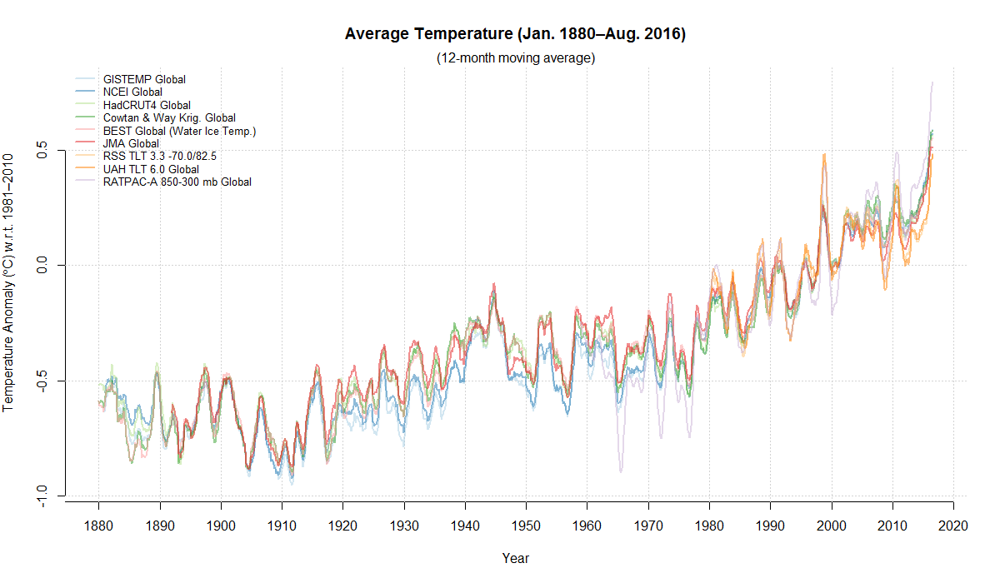
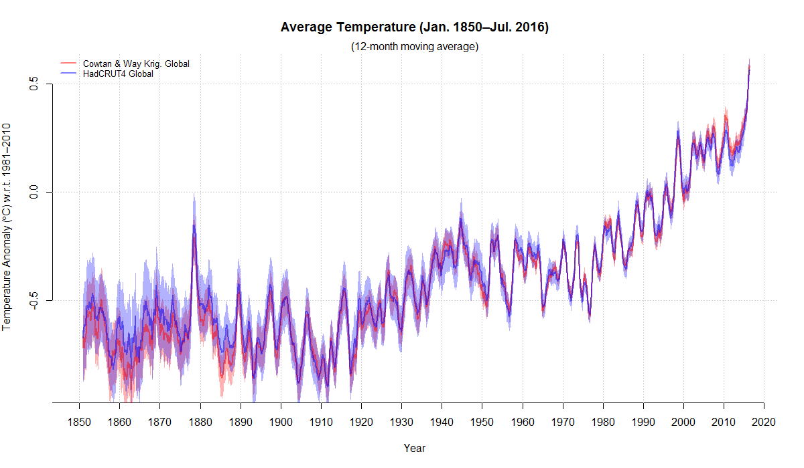

# climeseries
Download, aggregate, process, and display monthly climatological data.

## I don't care about the stupid package&mdash;where's the latest data?!
Geez, okay, [here](inst/extdata/latest/climate-series_20160908.zip?raw=true).

## Preliminaries
The *climeseries* R package is fairly easy to set up. In an R session:
```
install.packages("devtools") # If necessary.
library(devtools)
install_github("priscian/climeseries")
library(climeseries)

## Once the package has been installed as described above, all you need to use it is:
library(climeseries)
```

## Using *climeseries*
*climeseries* will by default store downloaded data sets in the current working directory (i.e. `getwd()`) of your R session, and will also load existing data sets from that directory. If you want to change *climeseries*'s default directory, set the following option (with a directory of your choice) before you use *climeseries*:
```
options(climeseries_data_dir="C:/common/data/climate/climeseries")
```
Now you're ready to go:
```
## Download a current climatological data set from the Internet.
inst <- get_climate_data(download=TRUE, baseline=TRUE)

## Try loading this most recent data set from the default directory.
inst <- get_climate_data(download=FALSE, baseline=TRUE)

## Description of the data set returned by 'get_climate_data()'.
?get_climate_data
```
Note that `get_climate_data()` saves the current climatological data set, in the default directory, as three different file types: `.RData`, `.dput`, and `.csv`; the `.csv` file is the most portable type and can be imported into other data-management software such as Microsoft Excel for plotting or further processing.

### Making plots
*climeseries* has pair of functions, `plot_climate_data()` and `plot_models_and_climate_data()`, to simplify plotting climate time series. Some examples follow.
```
########################################
## Plot several global instrumental temperature series.
########################################

inst <- get_climate_data(download=FALSE, baseline=TRUE)
series <- c("GISTEMP Global", "NCEI Global", "HadCRUT4 Global", "Cowtan & Way Krig. Global",
  "BEST Global (Water Ice Temp.)", "JMA Global", "RSS TLT 3.3 -70.0/82.5", "UAH TLT 6.0 Global", "RATPAC-A 850-300 mb Global")
plot_climate_data(inst, series=series, 1880, ma=12, lwd=2)
```



```
########################################
## Plot global instrumental temperature series with 95% confidence intervals.
########################################

inst <- get_climate_data(download=FALSE, baseline=TRUE)
series <- c("Cowtan & Way Krig. Global", "HadCRUT4 Global")
plot_climate_data(inst, series=series, 1850, ma=12, lwd=2, conf_int=TRUE, col=c("red", "blue"))
```



```
########################################
## Plot all CMIP5 scenario realizations, no instrumental temperature series.
########################################

inst <- get_climate_data(download=FALSE, baseline=TRUE)
cmip5 <- get_models_data(ensemble="cmip5")
plot_models_and_climate_data(inst, cmip5, series=NA, scenario=NULL, start=1950, end=2100, ma=12, baseline=1981:2010,
  center_fun="mean", smooth_envelope=TRUE, col_m_mean="red", ylim=c(-1, 5))
```


```
########################################
## CMIP5 RCP 4.5 scenario realizations compared to the GISTEMP land+SST series.
########################################

inst <- get_climate_data(download=FALSE, baseline=TRUE)
cmip5 <- get_models_data(ensemble="cmip5")
series <- c("GISTEMP Global")
plot_models_and_climate_data(inst, cmip5, series=series, scenario="RCP 4.5", start=1880, end=2020, ma=12,
  ma_i=12, baseline=1951:1980, center_fun="mean", smooth_envelope=TRUE, envelope_type="quantiles",
  envelope_text="quantiles", ylim=c(-1.0, 1.5), conf_int_i=FALSE, col_i_fun="topo.colors", col_i_fun...=list())
```


### More information
*climeseries* is presented here as a working beta. For more information on what the package offers, check out
```
library(help=climeseries)
```
from the R command line.

## Data sets
The latest data sets downloaded by me (where "latest" means whenever I've gotten around to updating them) can be found here: [Current "climeseries" data](inst/extdata/latest/climate-series_20160908.zip?raw=true). Older data sets are listed [here](inst/extdata/latest), too.

### Latest column names
The current column names&mdash;the names of the monthly climatological data sets&mdash;are given below. You will eventually find more information on each data set from the R command line via:
```
?get_climate_data
```

1. year
1. met_year
1. yr_part
1. month
1. Antarctica Land Ice Mass Variation
1. Antarctica Land Ice Mass Variation_uncertainty
1. BEST Global (Air Ice Temp.)
1. BEST Global (Water Ice Temp.)
1. BEST Global (Air Ice Temp.)_uncertainty
1. BEST Global (Water Ice Temp.)_uncertainty
1. BEST Global Land
1. BEST Global Land_uncertainty
1. BEST Greenland
1. BEST Greenland_uncertainty
1. BEST NH Land
1. BEST NH Land_uncertainty
1. BEST SH Land
1. BEST SH Land_uncertainty
1. BEST US
1. BEST US_uncertainty
1. CO2 Mauna Loa
1. Cowtan & Way Krig. Global
1. Cowtan & Way Krig. Global_uncertainty
1. CSIRO Global Mean Sea Level
1. ERSSTv4 Land 00N-30N
1. ERSSTv4 Land 00N-90N
1. ERSSTv4 Land 20N-90N
1. ERSSTv4 Land 20S-20N
1. ERSSTv4 Land 30N-60N
1. ERSSTv4 Land 30S-00N
1. ERSSTv4 Land 60N-90N
1. ERSSTv4 Land 60S-30S
1. ERSSTv4 Land 60S-60N
1. ERSSTv4 Land 90S-00N
1. ERSSTv4 Land 90S-20S
1. ERSSTv4 Land 90S-60S
1. ERSSTv4 Land 90S-90N
1. ERSSTv4 Land + Ocean 00N-30N
1. ERSSTv4 Land + Ocean 00N-90N
1. ERSSTv4 Land + Ocean 20N-90N
1. ERSSTv4 Land + Ocean 20S-20N
1. ERSSTv4 Land + Ocean 30N-60N
1. ERSSTv4 Land + Ocean 30S-00N
1. ERSSTv4 Land + Ocean 60N-90N
1. ERSSTv4 Land + Ocean 60S-30S
1. ERSSTv4 Land + Ocean 60S-60N
1. ERSSTv4 Land + Ocean 90S-00N
1. ERSSTv4 Land + Ocean 90S-20S
1. ERSSTv4 Land + Ocean 90S-60S
1. ERSSTv4 Land + Ocean 90S-90N
1. ERSSTv4 Ocean 00N-30N
1. ERSSTv4 Ocean 00N-90N
1. ERSSTv4 Ocean 20N-90N
1. ERSSTv4 Ocean 20S-20N
1. ERSSTv4 Ocean 30N-60N
1. ERSSTv4 Ocean 30S-00N
1. ERSSTv4 Ocean 60N-90N
1. ERSSTv4 Ocean 60S-30S
1. ERSSTv4 Ocean 60S-60N
1. ERSSTv4 Ocean 90S-00N
1. ERSSTv4 Ocean 90S-20S
1. ERSSTv4 Ocean 90S-60S
1. ERSSTv4 Ocean 90S-90N
1. ERSSTv4 Land 00N-30N_uncertainty
1. ERSSTv4 Land 00N-90N_uncertainty
1. ERSSTv4 Land 20N-90N_uncertainty
1. ERSSTv4 Land 20S-20N_uncertainty
1. ERSSTv4 Land 30N-60N_uncertainty
1. ERSSTv4 Land 30S-00N_uncertainty
1. ERSSTv4 Land 60N-90N_uncertainty
1. ERSSTv4 Land 60S-30S_uncertainty
1. ERSSTv4 Land 60S-60N_uncertainty
1. ERSSTv4 Land 90S-00N_uncertainty
1. ERSSTv4 Land 90S-20S_uncertainty
1. ERSSTv4 Land 90S-60S_uncertainty
1. ERSSTv4 Land 90S-90N_uncertainty
1. ERSSTv4 Land + Ocean 00N-30N_uncertainty
1. ERSSTv4 Land + Ocean 00N-90N_uncertainty
1. ERSSTv4 Land + Ocean 20N-90N_uncertainty
1. ERSSTv4 Land + Ocean 20S-20N_uncertainty
1. ERSSTv4 Land + Ocean 30N-60N_uncertainty
1. ERSSTv4 Land + Ocean 30S-00N_uncertainty
1. ERSSTv4 Land + Ocean 60N-90N_uncertainty
1. ERSSTv4 Land + Ocean 60S-30S_uncertainty
1. ERSSTv4 Land + Ocean 60S-60N_uncertainty
1. ERSSTv4 Land + Ocean 90S-00N_uncertainty
1. ERSSTv4 Land + Ocean 90S-20S_uncertainty
1. ERSSTv4 Land + Ocean 90S-60S_uncertainty
1. ERSSTv4 Land + Ocean 90S-90N_uncertainty
1. ERSSTv4 Ocean 00N-30N_uncertainty
1. ERSSTv4 Ocean 00N-90N_uncertainty
1. ERSSTv4 Ocean 20N-90N_uncertainty
1. ERSSTv4 Ocean 20S-20N_uncertainty
1. ERSSTv4 Ocean 30N-60N_uncertainty
1. ERSSTv4 Ocean 30S-00N_uncertainty
1. ERSSTv4 Ocean 60N-90N_uncertainty
1. ERSSTv4 Ocean 60S-30S_uncertainty
1. ERSSTv4 Ocean 60S-60N_uncertainty
1. ERSSTv4 Ocean 90S-00N_uncertainty
1. ERSSTv4 Ocean 90S-20S_uncertainty
1. ERSSTv4 Ocean 90S-60S_uncertainty
1. ERSSTv4 Ocean 90S-90N_uncertainty
1. GISTEMP Global
1. GISTEMP Global Land
1. GISTEMP NH
1. GISTEMP NH Land
1. GISTEMP SH
1. GISTEMP SH Land
1. GISTEMP Zonal Glob
1. GISTEMP Zonal NHem
1. GISTEMP Zonal SHem
1. GISTEMP Zonal 24N-90N
1. GISTEMP Zonal 24S-24N
1. GISTEMP Zonal 90S-24S
1. GISTEMP Zonal 64N-90N
1. GISTEMP Zonal 44N-64N
1. GISTEMP Zonal 24N-44N
1. GISTEMP Zonal EQU-24N
1. GISTEMP Zonal 24S-EQU
1. GISTEMP Zonal 44S-24S
1. GISTEMP Zonal 64S-44S
1. GISTEMP Zonal 90S-64S
1. GISTEMP Zonal Land Glob
1. GISTEMP Zonal Land NHem
1. GISTEMP Zonal Land SHem
1. GISTEMP Zonal Land 24N-90N
1. GISTEMP Zonal Land 24S-24N
1. GISTEMP Zonal Land 90S-24S
1. GISTEMP Zonal Land 64N-90N
1. GISTEMP Zonal Land 44N-64N
1. GISTEMP Zonal Land 24N-44N
1. GISTEMP Zonal Land EQU-24N
1. GISTEMP Zonal Land 24S-EQU
1. GISTEMP Zonal Land 44S-24S
1. GISTEMP Zonal Land 64S-44S
1. GISTEMP Zonal Land 90S-64S
1. Greenland Land Ice Mass Variation
1. Greenland Land Ice Mass Variation_uncertainty
1. HadCRUT4 Global
1. HadCRUT4 Global_uncertainty
1. HadCRUT4 NH
1. HadCRUT4 NH_uncertainty
1. HadCRUT4 SH
1. HadCRUT4 SH_uncertainty
1. HadCRUT4 Tropics
1. HadCRUT4 Tropics_uncertainty
1. HadSST3 Global
1. HadSST3 Global_uncertainty
1. HadSST3 NH
1. HadSST3 NH_uncertainty
1. HadSST3 SH
1. HadSST3 SH_uncertainty
1. HadSST3 Tropics
1. HadSST3 Tropics_uncertainty
1. JMA Global
1. NCEI Global
1. NCEI Global Land
1. NCEI Global Ocean
1. NCEI NH
1. NCEI NH Land
1. NCEI NH Ocean
1. NCEI SH
1. NCEI SH Land
1. NCEI SH Ocean
1. NCEI US Avg. Temp.
1. NCEI US Max. Temp.
1. NCEI US Min. Temp.
1. NCEI US Palmer Z-Index
1. NCEI US PDSI
1. NCEI US PHDI
1. NCEI US PMDI
1. NCEI US Precip.
1. NCEP Surface Air Global
1. NCEP Surface Air NH
1. NCEP Surface Air NH Polar
1. NCEP Surface Air SH
1. NCEP Surface Air SH Polar
1. NCEP Surface Air Tropics
1. NCEP Surface Air USA 48
1. NOAA Sunspot No.
1. NSIDC Sea Ice NH Extent
1. NSIDC Sea Ice NH Area
1. NSIDC Sea Ice SH Extent
1. NSIDC Sea Ice SH Area
1. NSIDC Sea Ice Global Extent
1. NSIDC Sea Ice Global Area
1. PIOMAS Arctic Sea Ice Volume
1. PMOD TSI (new VIRGO)
1. PMOD TSI (orig. VIRGO)
1. RATPAC-A 850 mb NH
1. RATPAC-A 700 mb NH
1. RATPAC-A 500 mb NH
1. RATPAC-A 400 mb NH
1. RATPAC-A 300 mb NH
1. RATPAC-A 250 mb NH
1. RATPAC-A 200 mb NH
1. RATPAC-A 150 mb NH
1. RATPAC-A 100 mb NH
1. RATPAC-A 70 mb NH
1. RATPAC-A 50 mb NH
1. RATPAC-A 30 mb NH
1. RATPAC-A 850 mb SH
1. RATPAC-A 700 mb SH
1. RATPAC-A 500 mb SH
1. RATPAC-A 400 mb SH
1. RATPAC-A 300 mb SH
1. RATPAC-A 250 mb SH
1. RATPAC-A 200 mb SH
1. RATPAC-A 150 mb SH
1. RATPAC-A 100 mb SH
1. RATPAC-A 70 mb SH
1. RATPAC-A 50 mb SH
1. RATPAC-A 30 mb SH
1. RATPAC-A 850 mb GLOBE
1. RATPAC-A 700 mb GLOBE
1. RATPAC-A 500 mb GLOBE
1. RATPAC-A 400 mb GLOBE
1. RATPAC-A 300 mb GLOBE
1. RATPAC-A 250 mb GLOBE
1. RATPAC-A 200 mb GLOBE
1. RATPAC-A 150 mb GLOBE
1. RATPAC-A 100 mb GLOBE
1. RATPAC-A 70 mb GLOBE
1. RATPAC-A 50 mb GLOBE
1. RATPAC-A 30 mb GLOBE
1. RATPAC-A 850 mb TROPICS (30S-30N)
1. RATPAC-A 700 mb TROPICS (30S-30N)
1. RATPAC-A 500 mb TROPICS (30S-30N)
1. RATPAC-A 400 mb TROPICS (30S-30N)
1. RATPAC-A 300 mb TROPICS (30S-30N)
1. RATPAC-A 250 mb TROPICS (30S-30N)
1. RATPAC-A 200 mb TROPICS (30S-30N)
1. RATPAC-A 150 mb TROPICS (30S-30N)
1. RATPAC-A 100 mb TROPICS (30S-30N)
1. RATPAC-A 70 mb TROPICS (30S-30N)
1. RATPAC-A 50 mb TROPICS (30S-30N)
1. RATPAC-A 30 mb TROPICS (30S-30N)
1. RATPAC-A 850 mb NH Extratropics
1. RATPAC-A 700 mb NH Extratropics
1. RATPAC-A 500 mb NH Extratropics
1. RATPAC-A 400 mb NH Extratropics
1. RATPAC-A 300 mb NH Extratropics
1. RATPAC-A 250 mb NH Extratropics
1. RATPAC-A 200 mb NH Extratropics
1. RATPAC-A 150 mb NH Extratropics
1. RATPAC-A 100 mb NH Extratropics
1. RATPAC-A 70 mb NH Extratropics
1. RATPAC-A 50 mb NH Extratropics
1. RATPAC-A 30 mb NH Extratropics
1. RATPAC-A 850 mb SH Extratropics
1. RATPAC-A 700 mb SH Extratropics
1. RATPAC-A 500 mb SH Extratropics
1. RATPAC-A 400 mb SH Extratropics
1. RATPAC-A 300 mb SH Extratropics
1. RATPAC-A 250 mb SH Extratropics
1. RATPAC-A 200 mb SH Extratropics
1. RATPAC-A 150 mb SH Extratropics
1. RATPAC-A 100 mb SH Extratropics
1. RATPAC-A 70 mb SH Extratropics
1. RATPAC-A 50 mb SH Extratropics
1. RATPAC-A 30 mb SH Extratropics
1. RATPAC-A 850 mb TROPICS (20S-20N)
1. RATPAC-A 700 mb TROPICS (20S-20N)
1. RATPAC-A 500 mb TROPICS (20S-20N)
1. RATPAC-A 400 mb TROPICS (20S-20N)
1. RATPAC-A 300 mb TROPICS (20S-20N)
1. RATPAC-A 250 mb TROPICS (20S-20N)
1. RATPAC-A 200 mb TROPICS (20S-20N)
1. RATPAC-A 150 mb TROPICS (20S-20N)
1. RATPAC-A 100 mb TROPICS (20S-20N)
1. RATPAC-A 70 mb TROPICS (20S-20N)
1. RATPAC-A 50 mb TROPICS (20S-20N)
1. RATPAC-A 30 mb TROPICS (20S-20N)
1. RATPAC-A 850-300 mb NH
1. RATPAC-A 850-300 mb SH
1. RATPAC-A 850-300 mb Global
1. RATPAC-A 850-300 mb Tropics
1. RATPAC-A 850-300 mb NH Extratropics
1. RATPAC-A 850-300 mb SH Extratropics
1. RATPAC-A 850-300 mb 20N-S
1. RATPAC-A 300-100 mb NH
1. RATPAC-A 300-100 mb SH
1. RATPAC-A 300-100 mb Global
1. RATPAC-A 300-100 mb Tropics
1. RATPAC-A 300-100 mb NH Extratropics
1. RATPAC-A 300-100 mb SH Extratropics
1. RATPAC-A 300-100 mb 20N-S
1. RATPAC-A 100-50 mb NH
1. RATPAC-A 100-50 mb SH
1. RATPAC-A 100-50 mb Global
1. RATPAC-A 100-50 mb Tropics
1. RATPAC-A 100-50 mb NH Extratropics
1. RATPAC-A 100-50 mb SH Extratropics
1. RATPAC-A 100-50 mb 20N-S
1. RSS TLT 3.3 -70.0/82.5
1. RSS TLT 3.3 -20.0/20.0
1. RSS TLT 3.3 20.0/82.5
1. RSS TLT 3.3 -70.0/-20.0
1. RSS TLT 3.3 60.0/82.5
1. RSS TLT 3.3 -70.0/-60.0
1. RSS TLT 3.3 Cont. USA
1. RSS TLT 3.3 0.0/82.5
1. RSS TLT 3.3 -70.0/0.0
1. RSS TLT 3.3 Land -70.0/82.5
1. RSS TLT 3.3 Land -20.0/20.0
1. RSS TLT 3.3 Land 20.0/82.5
1. RSS TLT 3.3 Land -70.0/-20.0
1. RSS TLT 3.3 Land 60.0/82.5
1. RSS TLT 3.3 Land -70.0/-60.0
1. RSS TLT 3.3 Ocean -70.0/82.5
1. RSS TLT 3.3 Ocean -20.0/20.0
1. RSS TLT 3.3 Ocean 20.0/82.5
1. RSS TLT 3.3 Ocean -70.0/-20.0
1. RSS TLT 3.3 Ocean 60.0/82.5
1. RSS TLT 3.3 Ocean -70.0/-60.0
1. RSS TMT 3.3 -82.5/82.5
1. RSS TMT 3.3 -20.0/20.0
1. RSS TMT 3.3 20.0/82.5
1. RSS TMT 3.3 -82.5/-20.0
1. RSS TMT 3.3 60.0/82.5
1. RSS TMT 3.3 -82.5/-60.0
1. RSS TMT 3.3 Cont. USA
1. RSS TMT 3.3 0.0/82.5
1. RSS TMT 3.3 -82.5/0.0
1. RSS TMT 3.3 Land -82.5/82.5
1. RSS TMT 3.3 Land -20.0/20.0
1. RSS TMT 3.3 Land 20.0/82.5
1. RSS TMT 3.3 Land -82.5/-20.0
1. RSS TMT 3.3 Land 60.0/82.5
1. RSS TMT 3.3 Land -82.5/-60.0
1. RSS TMT 3.3 Ocean -82.5/82.5
1. RSS TMT 3.3 Ocean -20.0/20.0
1. RSS TMT 3.3 Ocean 20.0/82.5
1. RSS TMT 3.3 Ocean -82.5/-20.0
1. RSS TMT 3.3 Ocean 60.0/82.5
1. RSS TMT 3.3 Ocean -82.5/-60.0
1. RSS TMT 4.0 -82.5/82.5
1. RSS TMT 4.0 -20.0/20.0
1. RSS TMT 4.0 20.0/82.5
1. RSS TMT 4.0 -82.5/-20.0
1. RSS TMT 4.0 60.0/82.5
1. RSS TMT 4.0 -82.5/-60.0
1. RSS TMT 4.0 Cont. USA
1. RSS TMT 4.0 0.0/82.5
1. RSS TMT 4.0 -82.5/0.0
1. RSS TMT 4.0 Land -82.5/82.5
1. RSS TMT 4.0 Land -20.0/20.0
1. RSS TMT 4.0 Land 20.0/82.5
1. RSS TMT 4.0 Land -82.5/-20.0
1. RSS TMT 4.0 Land 60.0/82.5
1. RSS TMT 4.0 Land -82.5/-60.0
1. RSS TMT 4.0 Ocean -82.5/82.5
1. RSS TMT 4.0 Ocean -20.0/20.0
1. RSS TMT 4.0 Ocean 20.0/82.5
1. RSS TMT 4.0 Ocean -82.5/-20.0
1. RSS TMT 4.0 Ocean 60.0/82.5
1. RSS TMT 4.0 Ocean -82.5/-60.0
1. Rutgers Eurasia Snow Cover
1. Rutgers N. America (No Greenland) Snow Cover
1. Rutgers N. America Snow Cover
1. Rutgers NH Snow Cover
1. TSI Reconstructed
1. UAH TLT 5.6 Global
1. UAH TLT 5.6 Global Land
1. UAH TLT 5.6 Global Ocean
1. UAH TLT 5.6 NH
1. UAH TLT 5.6 NH Land
1. UAH TLT 5.6 NH Ocean
1. UAH TLT 5.6 SH
1. UAH TLT 5.6 SH Land
1. UAH TLT 5.6 SH Ocean
1. UAH TLT 5.6 Tropics
1. UAH TLT 5.6 Tropics Land
1. UAH TLT 5.6 Tropics Ocean
1. UAH TLT 5.6 NH Extratropics
1. UAH TLT 5.6 NH Extratropics Land
1. UAH TLT 5.6 NH Extratropics Ocean
1. UAH TLT 5.6 SH Extratropics
1. UAH TLT 5.6 SH Extratropics Land
1. UAH TLT 5.6 SH Extratropics Ocean
1. UAH TLT 5.6 NH Polar
1. UAH TLT 5.6 NH Polar Land
1. UAH TLT 5.6 NH Polar Ocean
1. UAH TLT 5.6 SH Polar
1. UAH TLT 5.6 SH Polar Land
1. UAH TLT 5.6 SH Polar Ocean
1. UAH TLT 5.6 USA 48
1. UAH TLT 5.6 USA 48 + Alaska
1. UAH TLT 5.6 Australia
1. UAH TLT 6.0 Global
1. UAH TLT 6.0 Global Land
1. UAH TLT 6.0 Global Ocean
1. UAH TLT 6.0 NH
1. UAH TLT 6.0 NH Land
1. UAH TLT 6.0 NH Ocean
1. UAH TLT 6.0 SH
1. UAH TLT 6.0 SH Land
1. UAH TLT 6.0 SH Ocean
1. UAH TLT 6.0 Tropics
1. UAH TLT 6.0 Tropics Land
1. UAH TLT 6.0 Tropics Ocean
1. UAH TLT 6.0 NH Extratropics
1. UAH TLT 6.0 NH Extratropics Land
1. UAH TLT 6.0 NH Extratropics Ocean
1. UAH TLT 6.0 SH Extratropics
1. UAH TLT 6.0 SH Extratropics Land
1. UAH TLT 6.0 SH Extratropics Ocean
1. UAH TLT 6.0 NH Polar
1. UAH TLT 6.0 NH Polar Land
1. UAH TLT 6.0 NH Polar Ocean
1. UAH TLT 6.0 SH Polar
1. UAH TLT 6.0 SH Polar Land
1. UAH TLT 6.0 SH Polar Ocean
1. UAH TLT 6.0 USA 48
1. UAH TLT 6.0 USA 48 + Alaska
1. UAH TLT 6.0 Australia
1. UAH TMT 5.6 Global
1. UAH TMT 5.6 Global Land
1. UAH TMT 5.6 Global Ocean
1. UAH TMT 5.6 NH
1. UAH TMT 5.6 NH Land
1. UAH TMT 5.6 NH Ocean
1. UAH TMT 5.6 SH
1. UAH TMT 5.6 SH Land
1. UAH TMT 5.6 SH Ocean
1. UAH TMT 5.6 Tropics
1. UAH TMT 5.6 Tropics Land
1. UAH TMT 5.6 Tropics Ocean
1. UAH TMT 5.6 NH Extratropics
1. UAH TMT 5.6 NH Extratropics Land
1. UAH TMT 5.6 NH Extratropics Ocean
1. UAH TMT 5.6 SH Extratropics
1. UAH TMT 5.6 SH Extratropics Land
1. UAH TMT 5.6 SH Extratropics Ocean
1. UAH TMT 5.6 NH Polar
1. UAH TMT 5.6 NH Polar Land
1. UAH TMT 5.6 NH Polar Ocean
1. UAH TMT 5.6 SH Polar
1. UAH TMT 5.6 SH Polar Land
1. UAH TMT 5.6 SH Polar Ocean
1. UAH TMT 5.6 USA 48
1. UAH TMT 5.6 USA 48 + Alaska
1. UAH TMT 5.6 Australia
1. UAH TMT 6.0 Global
1. UAH TMT 6.0 Global Land
1. UAH TMT 6.0 Global Ocean
1. UAH TMT 6.0 NH
1. UAH TMT 6.0 NH Land
1. UAH TMT 6.0 NH Ocean
1. UAH TMT 6.0 SH
1. UAH TMT 6.0 SH Land
1. UAH TMT 6.0 SH Ocean
1. UAH TMT 6.0 Tropics
1. UAH TMT 6.0 Tropics Land
1. UAH TMT 6.0 Tropics Ocean
1. UAH TMT 6.0 NH Extratropics
1. UAH TMT 6.0 NH Extratropics Land
1. UAH TMT 6.0 NH Extratropics Ocean
1. UAH TMT 6.0 SH Extratropics
1. UAH TMT 6.0 SH Extratropics Land
1. UAH TMT 6.0 SH Extratropics Ocean
1. UAH TMT 6.0 NH Polar
1. UAH TMT 6.0 NH Polar Land
1. UAH TMT 6.0 NH Polar Ocean
1. UAH TMT 6.0 SH Polar
1. UAH TMT 6.0 SH Polar Land
1. UAH TMT 6.0 SH Polar Ocean
1. UAH TMT 6.0 USA 48
1. UAH TMT 6.0 USA 48 + Alaska
1. UAH TMT 6.0 Australia
