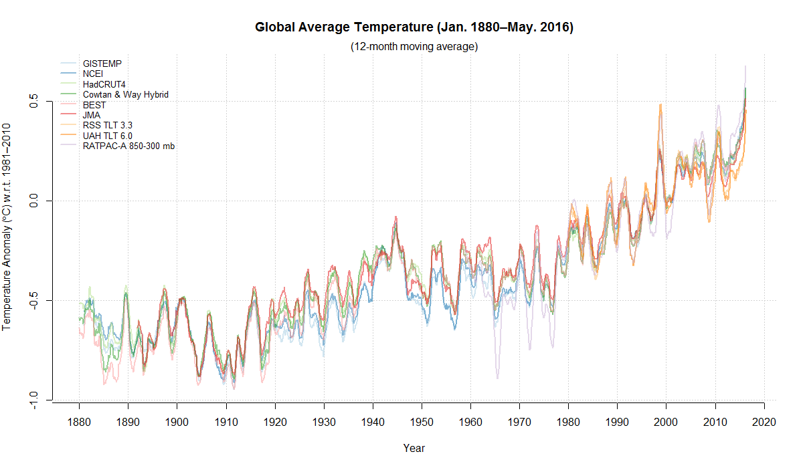
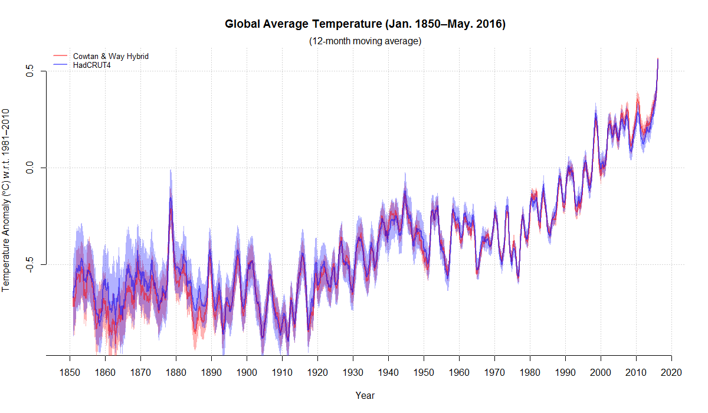
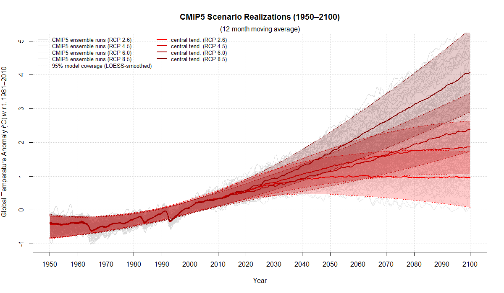
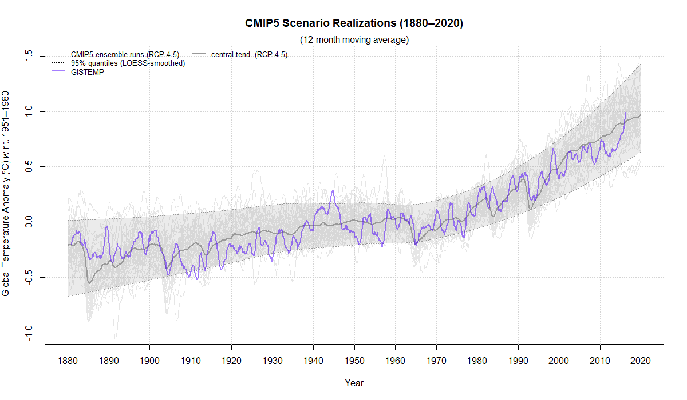

# climeseries
Download, aggregate, process, and display monthly climatological data.

## I don't care about the stupid package&mdash;where's the latest data?!
Geez, okay, [here](inst/extdata/latest/climate-series_20160712.zip?raw=true).

## Preliminaries
The *climeseries* R package is fairly easy to set up. In an R session:
```
install.packages("devtools") # If necessary.
library(devtools)
install_github("priscian/climeseries")
library(climeseries)

## Once the package has been installed as described above, all you need to use it is:
library(climeseries)
```

## Using *climeseries*
*climeseries* will by default store downloaded data sets in the current working directory (i.e. `getwd()`) of your R session, and will also load existing data sets from that directory. If you want to change *climeseries*'s default directory, set the following option (with a directory of your choice) before you use *climeseries*:
```
options(climeseries_data_dir="C:/common/data/climate/climeseries")
```
Now you're ready to go:
```
## Download a current climatological data set from the Internet.
inst <- get_climate_data(download=TRUE, baseline=TRUE)

## Try loading this most recent data set from the default directory.
inst <- get_climate_data(download=FALSE, baseline=TRUE)

## Description of the data set returned by 'get_climate_data()'.
?get_climate_data
```
Note that `get_climate_data()` saves the current climatological data set, in the default directory, as three different file types: `.RData`, `.dput`, and `.csv`; the `.csv` file is the most portable type and can be imported into other data-management software such as Microsoft Excel for plotting or further processing.

### Making plots
*climeseries* has pair of functions, `plot_climate_data()` and `plot_models_and_climate_data()`, to simplify plotting climate time series. Some examples follow.
```
########################################
## Plot several global instrumental temperature series.
########################################

inst <- get_climate_data(download=FALSE, baseline=TRUE)
series <- c("GISTEMP", "NCEI", "HadCRUT4", "Cowtan & Way Hybrid", "BEST", "JMA", "RSS TLT 3.3", "UAH TLT 6.0",
  "RATPAC-A 850-300 mb Global")
plot_climate_data(inst, series=series, 1880, ma=12, lwd=2)
```



```
########################################
## Plot global instrumental temperature series with 95% confidence intervals.
########################################

inst <- get_climate_data(download=FALSE, baseline=TRUE)
series <- c("Cowtan & Way Hybrid", "HadCRUT4")
plot_climate_data(inst, series=series, 1850, ma=12, lwd=2, conf_int=TRUE, col=c("red", "blue"))
```



```
########################################
## Plot all CMIP5 scenario realizations, no instrumental temperature series.
########################################

inst <- get_climate_data(download=FALSE, baseline=TRUE)
cmip5 <- get_models_data(ensemble="cmip5")
plot_models_and_climate_data(inst, cmip5, series=NA, scenario=NULL, start=1950, end=2100, ma=12, baseline=1981:2010,
  center_fun="mean", smooth_envelope=TRUE, col_m_mean="red", ylim=c(-1, 5))
```



```
########################################
## CMIP5 RCP 4.5 scenario realizations compared to the GISTEMP land+SST series.
########################################

inst <- get_climate_data(download=FALSE, baseline=TRUE)
cmip5 <- get_models_data(ensemble="cmip5")
series <- c("GISTEMP")
plot_models_and_climate_data(inst, cmip5, series=series, scenario="RCP 4.5", start=1880, end=2020, ma=12,
  ma_i=12, baseline=1951:1980, center_fun="mean", smooth_envelope=TRUE, envelope_type="quantiles",
  envelope_text="quantiles", ylim=c(-1.0, 1.5), conf_int_i=FALSE, col_i_fun="topo.colors", col_i_fun...=list())
```



### More information
*climeseries* is presented here as a working beta. For more information on what the package offers, check out
```
library(help=climeseries)
```
from the R command line.

### Data sets
The latest data sets downloaded by me (where "latest" means whenever I've gotten around to updating them) can be found here: [Current "climeseries" data](inst/extdata/latest/climate-series_20160712.zip?raw=true). Older data sets are listed [here](inst/extdata/latest), too.
