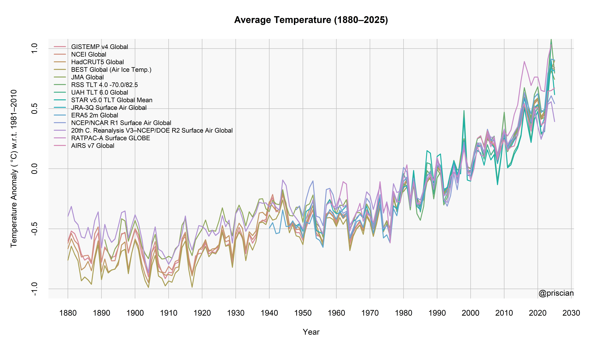
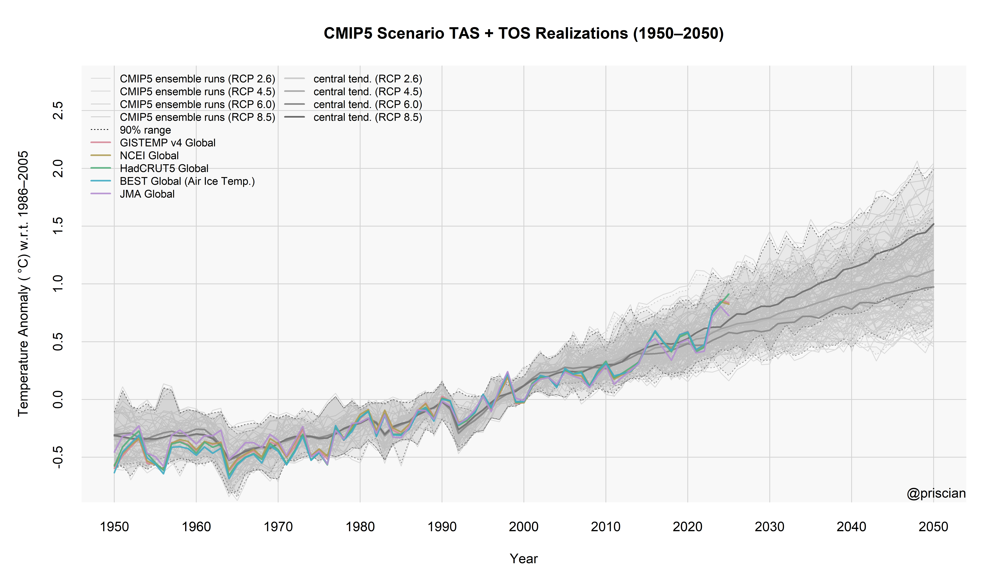
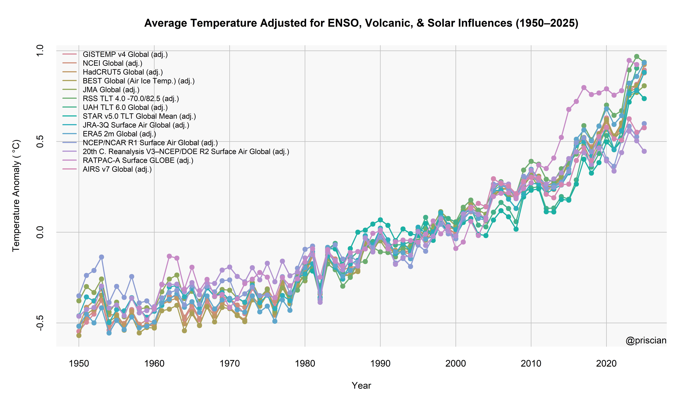
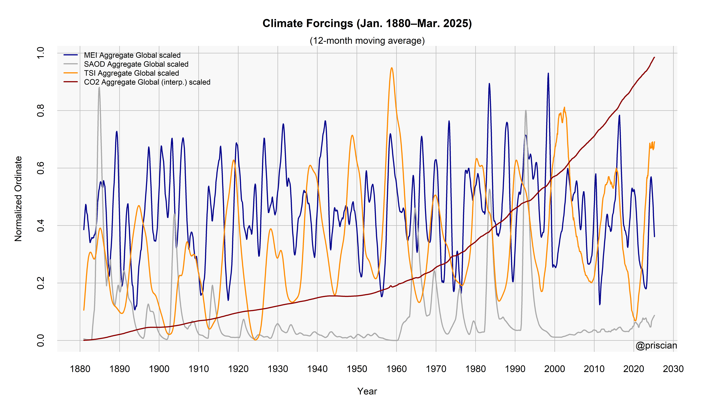
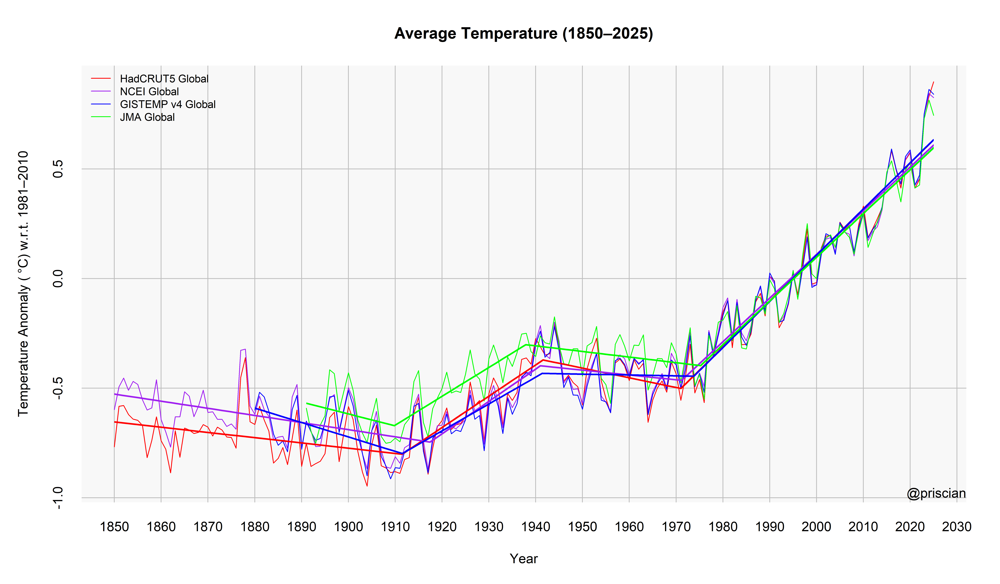
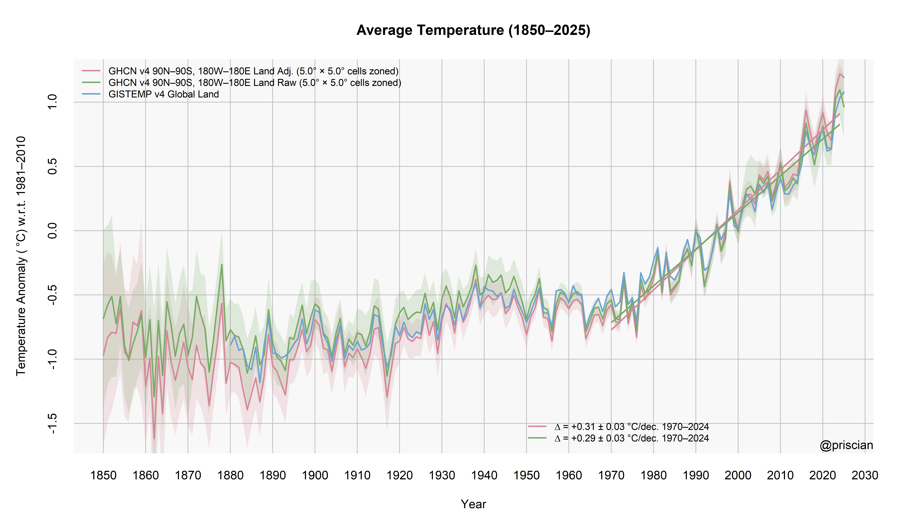
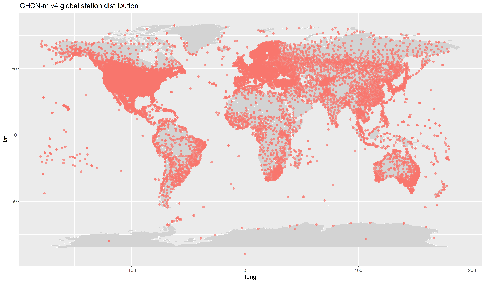

# climeseries
Download, aggregate, process, and display monthly climatological data.

## I don't care about the stupid package&mdash;where's the latest data?!
Okay! It's [here](inst/extdata/latest/climate-series_20241117.zip?raw=true). The "raw" data (as close as possible to the official source) is file `climate-series_raw_yyyymmdd.csv`; the data given as anomalies from a 1981–2010 baseline is file `climate-series_yyyymmdd.csv`. It's tabular data, arranged rows × columns for month/year × monthly series.

*climeseries* includes more than 1000 individual monthly climate time series; the full set of series names is listed [below](#latest-column-names).

(If you're instead looking for the [list of paleoclimate studies](https://gist.github.com/priscian/5a10f13dbf727048aee17e5d3849041a) that use a variety of temperature proxies and methodologies in affirmation of [Michael Mann's hockey stick result](https://dx.doi.org/10.1038/33859), you can find that [here](https://gist.github.com/priscian/5a10f13dbf727048aee17e5d3849041a).)

## Preliminaries
The *climeseries* R package is fairly easy to set up. In an R session:
```r
install.packages("remotes") # If necessary.
Sys.setenv(R_REMOTES_NO_ERRORS_FROM_WARNINGS = "true") # Probably unnecessary now. See:
## https://github.com/r-lib/remotes#environment-variables
remotes::install_github("priscian/climeseries")
library(climeseries)

## Once the package has been installed as described above, all you need to use it is:
library(climeseries)
```

## Using *climeseries*
*climeseries* will by default store downloaded data sets in the current working directory (i.e. `getwd()`) of your R session, and will also load existing data sets from that directory. If you want to change *climeseries*'s default directory, set the following option (with a directory of your choice) before you use *climeseries*:
```r
options(climeseries_data_dir = "C:/common/data/climate/climeseries")
```
Now you're ready to go:
```r
## Download a current climatological data set from the Internet.
inst <- get_climate_data(download = TRUE)
## N.B. I don't recommend the full download, which requires managing changing URLs &
##   download permissions; instead, use the latest data sets downloaded with the package,
##   or request an update from me. I'll make the download mechanism more flexible soon....

## Try loading this most recent data set from the default directory.
inst <- get_climate_data(download = FALSE, baseline = TRUE)

## Description of the data set returned by 'get_climate_data()'.
?get_climate_data
```
Note that `get_climate_data()` saves the current climatological data set, in the default directory, as two different file types: `.RData` and `.csv`; the `.csv` file is the most portable type and can be imported into other data-management software such as Microsoft Excel for plotting or further processing.

### Making plots
*climeseries* has a pair of functions, `plot_climate_data()` and `plot_models_and_climate_data()`, to simplify plotting climate time series. Some examples follow.
```r
########################################
## Plot several global instrumental temperature series.
########################################

airs_series <- "AIRS v7 Global"; baseline <- 1981:2010
new_airs <- interpolate_baseline(airs_series, baseline = baseline)
inst0 <- get_climate_data(download = FALSE, baseline = FALSE)
inst0 <- create_aggregate_variable(inst0, c("20th C. Reanalysis V3 Surface Air Global",
  "NCEP/DOE R2 Surface Air Global"),
  "20th C. Reanalysis V3–NCEP/DOE R2 Surface Air Global", type = "head")
inst0[[airs_series]] <- new_airs[[airs_series]]
series <- c("GISTEMP v4 Global", "NCEI Global", "HadCRUT5 Global",
  "BEST Global (Air Ice Temp.)", "JMA Global", "RSS TLT 4.0 -70.0/82.5",
  "UAH TLT 6.0 Global", "JRA-55 Surface Air Global", "ERA5 2m Global",
  "NCEP/NCAR R1 Surface Air Global", "20th C. Reanalysis V3–NCEP/DOE R2 Surface Air Global",
  "RATPAC-A Surface GLOBE", airs_series)
inst <- inst0 %>%
  dplyr::select(all_of(c(get_climate_series_names(inst0, invert = FALSE), series))) %>%
  recenter_anomalies(baseline = baseline, keep = series, skip = "AIRS v7 Global")
## N.B. Don't rebaseline here!
plot_climate_data(inst, series = series, 1880, yearly = TRUE, lwd = 2, ylim = c(-1.0, 1.0),
  save_png = FALSE)
```



```r
########################################
## Plot global instrumental temperature series with 95% confidence intervals.
########################################

inst <- get_climate_data(download = FALSE, baseline = TRUE)
series <- c("BEST Global (Air Ice Temp.)", "HadCRUT5 Global")
plot_climate_data(inst, series = series, 1850, yearly = TRUE, lwd = 2, conf_int = TRUE,
  col = c("red", "blue"), alpha = 0.4, ci_alpha = 0.1, save_png = FALSE)
```


```r
########################################
## Plot all CMIP5 scenario realizations, no instrumental temperature series.
########################################

inst <- get_climate_data(download = FALSE, baseline = TRUE)
cmip5 <- get_models_data(ensemble = "cmip5")
plot_models_and_climate_data(inst, cmip5, series = NULL, scenario = NULL, start = 1950,
  end = 2100.99, ma = 12, baseline = 1981:2010, center_fun = "mean", smooth_envelope = TRUE,
  col_m_mean = "red", ylim = c(-1, 5), save_png = FALSE)
```


```r
########################################
## CMIP5 RCP 8.5 TAS + TOS scenario realizations compared to the primary land+SST series.
## Cf. Fig. 4(a) of Cowtan et al. 2015, dx.doi.org/10.1002/2015GL064888
########################################

inst <- get_climate_data(download = FALSE, baseline = TRUE)
cmip5 <- get_models_data(ensemble = "cmip5", subdir = "tas + tos")
series <- c("GISTEMP v4 Global", "NCEI Global", "HadCRUT5 Global",
  "BEST Global (Air Ice Temp.)", "JMA Global")
plot_models_and_climate_data(inst, cmip5, series = series, scenario = NULL, start = 1950,
  end = 2050.99, yearly = TRUE, ma = 12, baseline = 1986:2005, scenario_text =
  "Scenario TAS + TOS Realizations", center_fun = "mean", smooth_envelope = FALSE,
  envelope_type = "range", envelope_coverage = 0.90, envelope_text = "range",
  ylim = c(-0.75, 2.75), conf_int_i = FALSE, col_m_mean = grDevices::gray(0.8),
  alpha_envelope = 0.1, save_png = FALSE)
```



```r
########################################
## Remove influence of exogenous factors characterizing ENSO, volcanic activity, and solar.
## Cf. Foster & Rahmstorf 2011, dx.doi.org/10.1088/1748-9326/6/4/044022
## Update 2024: https://tamino.wordpress.com/2024/02/16/adjusted-global-temperature-data/
########################################

inst <- get_climate_data(download = FALSE, baseline = FALSE)
inst <- create_aggregate_variable(inst, c("20th C. Reanalysis V3 Surface Air Global",
  "NCEP/DOE R2 Surface Air Global"),
  "20th C. Reanalysis V3–NCEP/DOE R2 Surface Air Global", type = "head")
series <- c("GISTEMP v4 Global", "NCEI Global", "HadCRUT5 Global",
  "BEST Global (Air Ice Temp.)", "JMA Global", "RSS TLT 4.0 -70.0/82.5",
  "UAH TLT 6.0 Global", "JRA-55 Surface Air Global", "ERA5 2m Global",
  "NCEP/NCAR R1 Surface Air Global", "20th C. Reanalysis V3–NCEP/DOE R2 Surface Air Global")
start <- 1950; end <- NULL
g <- remove_exogenous_influences(inst, series = series, start = start, end = end, max_lag = 12)
series_adj <- paste(series, "(adj.)")
main <- "Average Temperature Adjusted for ENSO, Volcanic, & Solar Influences"
plot_climate_data(g, series_adj, yearly = TRUE, main = main, type = "o", pch = 19, baseline = TRUE,
  save_png = FALSE)

## Plot several forcing variables
inst <- get_climate_data(download = FALSE, baseline = FALSE) %>%
  add_default_aggregate_variables()
forcings <- c("MEI Aggregate Global", "SAOD Aggregate Global", "TSI Aggregate Global",
  "CO2 Aggregate Global (interp.)")
forcings_scaled <- paste(forcings, "scaled")
forcings_start_year <- 1880
plyr::l_ply(forcings, function(a) { inst[[paste(a, "scaled")]] <<-
  inst[[a]] %>% `is.na<-`(inst$year < forcings_start_year) %>% `-`(min(., na.rm = TRUE)) %>%
    `/`(max(., na.rm = TRUE)) }) # Optimize white space
plot_climate_data(inst, series = forcings_scaled[1:4], start = forcings_start_year,
  ylab = "Normalized Ordinate", main = "Climate Forcings", ma = 12, yearly = FALSE, lwd = 2,
  col = c("darkblue", "darkgrey", "darkorange", "darkred"), save_png = FALSE)
```




```r
########################################
## Estimate optimal no. & location of significant changepoints in piecewise regression of
##   climate series.
## Cf. Figure 1 of Cahill et al. 2015, dx.doi.org/10.1088/1748-9326/10/8/084002
########################################

inst <- get_climate_data(download = FALSE, baseline = TRUE)
series <- c("HadCRUT5 Global", "NCEI Global", "GISTEMP v4 Global", "JMA Global")
plot_climate_data(inst, series, yearly = TRUE, col = c("red", "purple", "blue", "green"), lwd = 1,
  segmented = TRUE, save_png = FALSE)
```



```r
########################################
## Has sea-level rise accelerated?
## V. Church & White 2011, dx.doi.org/10.1007/s10712-011-9119-1.
## V. https://tamino.wordpress.com/2017/10/24/what-is-sea-level-up-to-lately
########################################

inst <- get_climate_data(download = FALSE, baseline = FALSE)
slr_series <- c("CSIRO Reconstructed Global Mean Sea Level", "AVISO Global Mean Sea Level")
slr <- purrr::reduce(
  list(
    inst,
    remove_periodic_cycle(inst, slr_series[1], center = FALSE, keep_series = FALSE,
      suffix = " (non-seasonal)"),
    remove_periodic_cycle(inst, slr_series[2], center = FALSE, keep_series = FALSE,
      suffix = " (non-seasonal)")
  ), dplyr::full_join) %>%
  dplyr::mutate(yr_part = year + (2 * month - 1)/24, .after = "month") %>%
  dplyr::arrange(year, month)
slr_baseline <- 1993:2013
slr <- create_aggregate_variable(slr, c("CSIRO Reconstructed Global Mean Sea Level (non-seasonal)",
  "AVISO Global Mean Sea Level (non-seasonal)"), "Global Mean Sea Level Aggregate",
  type = "head", baseline = slr_baseline)

sm <- fit_segmented_model(oss(slr, "Global Mean Sea Level Aggregate"),
  "Global Mean Sea Level Aggregate", yearly = TRUE, breakpoints... = list(h = 36, breaks = NULL))

slr_cols <- c("#1F78B4", "#33A02C")
slr_ylab <- sprintf("Global Mean Sea Level (mm) w.r.t %s–%s", min(slr_baseline), max(slr_baseline))
slr_main <- "Composite GMSL (Reconstruction + Satellite Altimetry)"
slr_end_callback <- expression({
  plot(sm$piecewise[["Global Mean Sea Level Aggregate"]]$sm, col = scales::alpha("red", 0.4),
    add = TRUE, rug = FALSE)
  psi <- sprintf(sm$piecewise[["Global Mean Sea Level Aggregate"]]$sm$psi[, 2], fmt = "%1.1f")
  vline(psi)
  ptbl <- segmented::slope(sm$piecewise[["Global Mean Sea Level Aggregate"]]$sm)$year %>%
    apply(2, sprintf, fmt = "%1.2f")
  colnames(ptbl)[1] <- "Rate (mm/y)"
  yr <- sm$piecewise[["Global Mean Sea Level Aggregate"]]$sm$model$year
  rownames(ptbl) <- c(min(yr), sort(rep(psi %>% as.numeric %>% round, 2)), max(yr)) %>%
    keystone::chunk(2) %>% sapply(paste, collapse = "–")
  ptbl %>% plotrix::addtable2plot(x = 1940, y = -200, table = ., cex = 0.8, bg = "lightgray",
    display.rownames = TRUE)
})
plot_climate_data(slr, series = paste(slr_series, "(non-seasonal)"), yearly = TRUE,
  baseline = slr_baseline, conf_int = TRUE, col = slr_cols, lwd = 2, main = slr_main,
  ylab = slr_ylab, ylim = NULL, end_callback = slr_end_callback, save_png = FALSE)
```


```r
########################################
## Calculate global average land temperature anomalies from GHCN-m station data, w/ 95% CI.
## SOP:
## • For each station/month, calc 1951–1980 baseline
## • Compute temp anomalies by subtracting station/month baseline from absolute temps
## • Split region into lat-long grid
## • For each grid cell, get monthly avg of all anomalies
## • Lat-weight each cell & calc monthly region avg
########################################

## If 'download' = TRUE, import & prep data from https://www.ncei.noaa.gov/pub/data/ghcn/v4/
## (It will take a while, so be patient; later, you can use 'download = FALSE'.)
download <- TRUE
ghcn_v4_avg_f <- new.env()
get_series_from_ghcn_gridded(ver = 4, temp = "avg", quality = "f", load_env = ghcn_v4_avg_f,
  download = download)

ghcn_v4_avg_u <- new.env()
get_series_from_ghcn_gridded(ver = 4, temp = "avg", quality = "u", load_env = ghcn_v4_avg_u,
  download = download)

## Select only stations (e.g.) which are longer-term over the coverage period
coverage_years <- NULL # Default: keep all stations
meets_filter_criteria_u <- make_coverage_filter(ghcn_v4_avg_u$ghcn, coverage_years,
  min_nonmissing_months = 12, min_nonmissing_years_prop = 0.9)
meets_filter_criteria_u %>% table
meets_filter_criteria_f <- make_coverage_filter(ghcn_v4_avg_f$ghcn, coverage_years,
  min_nonmissing_months = 12, min_nonmissing_years_prop = 0.9)
meets_filter_criteria_f %>% table

## In the case of adj. v unadj., however, the temporal coverage is usu. different;
##   so for comparison, let's use the unadj. stations for both series.
gf <-
  ghcn_v4_avg_f$ghcn %>% dplyr::select(any_of(c(get_climate_series_names(., invert = FALSE),
  meets_filter_criteria_u[meets_filter_criteria_u] %>% names)))

lat_range <- c(90, -90); long_range <- c(-180, 180) # Default global coverage
#lat_range <- c(0, -90); long_range <- c(-180, 180) # Southern hemisphere
#lat_range <- c(37, 71); long_range <- c(-22, 45) # Europe
#lat_range <- c(90, 60); long_range <- c(-180, 180) # Arctic
#lat_range <- c(50, 25); long_range <- c(-125, -70) # USA
round_to_nearest <- NULL #1.0

## Supply paths to XLSX files to store portable versions of data & results:
spreadsheet_path_f <- spreadsheet_path_u <- NULL

grid_size <- c(5, 5)
use_lat_zonal_weights <- TRUE

## Raw data
uadj_ghcn_v4_avg_u <-
  make_ghcn_temperature_series(ghcn_v4_avg_u$ghcn, ghcn_v4_avg_u$station_metadata,
    other_filters = meets_filter_criteria_u, grid_size = grid_size, lat_range = lat_range,
    long_range = long_range, make_planetary_grid... = list(use_lat_weights = TRUE),
    use_lat_zonal_weights = use_lat_zonal_weights, uncertainty = TRUE, boot_seed = NULL,
    round_to_nearest = round_to_nearest, spreadsheet_path = spreadsheet_path_u)

## Homogenized/adjusted data
adj_ghcn_v4_avg_f <-
  make_ghcn_temperature_series(gf, ghcn_v4_avg_f$station_metadata, grid_size = grid_size,
    lat_range = lat_range, long_range = long_range,
    make_planetary_grid... = list(use_lat_weights = TRUE),
    use_lat_zonal_weights = use_lat_zonal_weights, uncertainty = TRUE, boot_seed = NULL,
    round_to_nearest = round_to_nearest, spreadsheet_path = spreadsheet_path_f)

## Collect both data sets & equivalent official series for comparison
inst <- get_climate_data(download = FALSE, baseline = FALSE) %>%
  { purrr::reduce(list(., adj_ghcn_v4_avg_f, uadj_ghcn_v4_avg_u), dplyr::full_join,
    by = c("month", "year")) } %>%
  dplyr::mutate(yr_part = year + (month - 0.5)/12, met_year = NA)

series <- c(names(adj_ghcn_v4_avg_f)[3], names(uadj_ghcn_v4_avg_u)[3],
  "GISTEMP v4 Global Land")

extra_trends <- sapply(series[1:2],
  function(a) { list(range = c(1970, current_year - 0.01), lwd = 2) }, simplify = FALSE)
## Plot both data sets & equivalent official series for comparison
r <-
  plot_climate_data(inst, series = series[1:3], 1850, yearly = TRUE, baseline = 1981:2010,
    conf_int = TRUE, conf_int_series = NULL, ci_alpha = c(0.2, 0.2, 0.2), lwd = c(2, 2),
    ylim = NULL, alpha = c(1, 1, 1), trend = TRUE, trend... = list(keep_default_trends = FALSE,
    rate_expression =
      sprintf("expression(Delta ~ \"= %%+1.2f ± %%1.2f %s/dec. %s\")", "°C", "1970–" %_%
        (current_year - 1))),
    extra_trends = extra_trends, trend_legend_inset = c(0.2, 0.01),
    make_standardized_plot_filename... = list(suffix = "1970_adj-v-unadj-all"),
    save_png = FALSE)

## Station counts
station_counts <- get_station_counts(x = uadj_ghcn_v4_avg_u, env = ghcn_v4_avg_u,
  region_name = "v4 Global Complete", start_year = 1850, end_year = current_year - 0.01,
  save_png = FALSE)
## Max station count for a single month:
station_counts$station_counts_series$`station count` %>% max(na.rm = TRUE) %>% print
## Total no. of stations used in average temp series:
station_counts$station_series %>% get_climate_series_names %>% length %>% print

## Station distribution
plot_stations_map(attr(uadj_ghcn_v4_avg_u, "filtered_metadata"), region_name = "global",
  title_text = sprintf("GHCN-m v4 global station distribution"), save_png = FALSE)
```





### More information
*climeseries* is presented here as a working beta. For more information on what the package offers, check out
```r
library(help = climeseries)
```
from the R command line.

## Data sets
The latest data sets downloaded by me (where "latest" means whenever I've gotten around to updating them) can be found here: [Current "climeseries" data](inst/extdata/latest/climate-series_20241117.zip?raw=true). Older data sets are listed [here](inst/extdata/latest), too.

### Latest column names
The current column names&mdash;the names of the monthly climatological data sets&mdash;are given below. You will eventually find more information on each data set from the R command line via:
```r
?get_climate_data
```

1. year
1. met_year
1. yr_part
1. month
1. 20th C. Reanalysis V3 Sea Surface Global
1. 20th C. Reanalysis V3 Sea Surface NH
1. 20th C. Reanalysis V3 Sea Surface SH
1. 20th C. Reanalysis V3 Surface Air Global
1. 20th C. Reanalysis V3 Surface Air Global Land
1. 20th C. Reanalysis V3 Surface Air Global Ocean
1. 20th C. Reanalysis V3 Surface Air NH
1. 20th C. Reanalysis V3 Surface Air NH Land
1. 20th C. Reanalysis V3 Surface Air NH Ocean
1. 20th C. Reanalysis V3 Surface Air NH Polar
1. 20th C. Reanalysis V3 Surface Air NH Polar Land
1. 20th C. Reanalysis V3 Surface Air NH Polar Ocean
1. 20th C. Reanalysis V3 Surface Air SH
1. 20th C. Reanalysis V3 Surface Air SH Land
1. 20th C. Reanalysis V3 Surface Air SH Ocean
1. 20th C. Reanalysis V3 Surface Air SH Polar
1. 20th C. Reanalysis V3 Surface Air SH Polar Land
1. 20th C. Reanalysis V3 Surface Air SH Polar Ocean
1. 20th C. Reanalysis V3 Surface Air Tropics
1. 20th C. Reanalysis V3 Surface Air Tropics Land
1. 20th C. Reanalysis V3 Surface Air Tropics Ocean
1. 20th C. Reanalysis V3 Surface Air USA 48
1. 20th C. Reanalysis V3 Surface Air USA 48 Land
1. 20th C. Reanalysis V3 Surface Air USA 48 Ocean
1. AIRS v6 Global
1. AIRS v7 Global
1. AIRS v6 N.Hemi
1. AIRS v7 N.Hemi
1. AIRS v6 S.Hemi
1. AIRS v7 S.Hemi
1. AIRS v6 Zonal Glob
1. AIRS v6 Zonal N.Hemi
1. AIRS v6 Zonal S.Hemi
1. AIRS v6 Zonal 24N-90N
1. AIRS v6 Zonal 24S-24N
1. AIRS v6 Zonal 90S-24S
1. AIRS v6 Zonal 64N-90N
1. AIRS v6 Zonal 44N-64N
1. AIRS v6 Zonal 24N-44N
1. AIRS v6 Zonal EQU-24N
1. AIRS v6 Zonal 24S-EQU
1. AIRS v6 Zonal 44S-24S
1. AIRS v6 Zonal 64S-44S
1. AIRS v6 Zonal 90S-64S
1. AIRS v7 Zonal Glob
1. AIRS v7 Zonal N.Hemi
1. AIRS v7 Zonal S.Hemi
1. AIRS v7 Zonal 24N-90N
1. AIRS v7 Zonal 24S-24N
1. AIRS v7 Zonal 90S-24S
1. AIRS v7 Zonal 64N-90N
1. AIRS v7 Zonal 44N-64N
1. AIRS v7 Zonal 24N-44N
1. AIRS v7 Zonal EQU-24N
1. AIRS v7 Zonal 24S-EQU
1. AIRS v7 Zonal 44S-24S
1. AIRS v7 Zonal 64S-44S
1. AIRS v7 Zonal 90S-64S
1. Antarctica Land Ice Mass Variation
1. Antarctica Land Ice Mass Variation_uncertainty
1. AVISO Global Mean Sea Level
1. AVISO Global Mean Sea Level (nonseasonal)
1. BEST Antarctica
1. BEST Antarctica_uncertainty
1. BEST Global (Air Ice Temp.)
1. BEST Global (Water Ice Temp.)
1. BEST Global (Air Ice Temp.)_uncertainty
1. BEST Global (Water Ice Temp.)_uncertainty
1. BEST Global Land
1. BEST Global Land_uncertainty
1. BEST Greenland
1. BEST Greenland_uncertainty
1. BE Land+SST (Air Ice Temp.) (0N-90N, 180W-180E)
1. BE Land+SST (Air Ice Temp.) (90S-0N, 180W-180E)
1. BEST NH Land
1. BEST NH Land_uncertainty
1. BEST SH Land
1. BEST SH Land_uncertainty
1. BEST US
1. BEST US_uncertainty
1. CO2 Cape Grim
1. CO2 Cape Grim_uncertainty
1. CO2 Mauna Loa
1. CO2 NOAA ESRL
1. Cowtan & Way Krig. Global
1. Cowtan & Way Krig. Global_uncertainty
1. Cowtan & Way Krig. Global Land
1. CRUTEM4 Global
1. CRUTEM4 NH
1. CRUTEM4 SH
1. CRUTEM4v Global
1. CRUTEM4v NH
1. CRUTEM4v SH
1. CRUTEM5 Global
1. CRUTEM5 Global_uncertainty
1. CRUTEM5 NH
1. CRUTEM5 NH_uncertainty
1. CRUTEM5 SH
1. CRUTEM5 SH_uncertainty
1. CSIRO Global Mean Sea Level
1. CSIRO Reconstructed Global Mean Sea Level
1. CSIRO Reconstructed Global Mean Sea Level_uncertainty
1. ERA5 2m Global
1. ERA5 2m European
1. ERA5 Surface Air Global
1. ERA5 Surface Air Global Land
1. ERA5 Surface Air Global Ocean
1. ERA5 Surface Air NH
1. ERA5 Surface Air NH Land
1. ERA5 Surface Air NH Ocean
1. ERA5 Surface Air NH Polar
1. ERA5 Surface Air NH Polar Land
1. ERA5 Surface Air NH Polar Ocean
1. ERA5 Surface Air SH
1. ERA5 Surface Air SH Land
1. ERA5 Surface Air SH Ocean
1. ERA5 Surface Air SH Polar
1. ERA5 Surface Air SH Polar Land
1. ERA5 Surface Air SH Polar Ocean
1. ERA5 Surface Air Tropics
1. ERA5 Surface Air Tropics Land
1. ERA5 Surface Air Tropics Ocean
1. ERA5 Surface Air USA 48
1. ERA5 Surface Air USA 48 Land
1. ERA5 Surface Air USA 48 Ocean
1. ESRL AMO
1. Extended Multivariate ENSO Index
1. GISS Stratospheric Aerosol Optical Depth (550 nm) Global
1. GISS Stratospheric Aerosol Optical Depth (550 nm) NH
1. GISS Stratospheric Aerosol Optical Depth (550 nm) SH
1. GISTEMP v3 Global
1. GISTEMP v3 Global Land
1. GISTEMP v3 NH
1. GISTEMP v3 NH Land
1. GISTEMP v3 SH
1. GISTEMP v3 SH Land
1. GISTEMP v3 Zonal Glob
1. GISTEMP v3 Zonal NHem
1. GISTEMP v3 Zonal SHem
1. GISTEMP v3 Zonal 24N-90N
1. GISTEMP v3 Zonal 24S-24N
1. GISTEMP v3 Zonal 90S-24S
1. GISTEMP v3 Zonal 64N-90N
1. GISTEMP v3 Zonal 44N-64N
1. GISTEMP v3 Zonal 24N-44N
1. GISTEMP v3 Zonal EQU-24N
1. GISTEMP v3 Zonal 24S-EQU
1. GISTEMP v3 Zonal 44S-24S
1. GISTEMP v3 Zonal 64S-44S
1. GISTEMP v3 Zonal 90S-64S
1. GISTEMP v3 Zonal Land Glob
1. GISTEMP v3 Zonal Land NHem
1. GISTEMP v3 Zonal Land SHem
1. GISTEMP v3 Zonal Land 24N-90N
1. GISTEMP v3 Zonal Land 24S-24N
1. GISTEMP v3 Zonal Land 90S-24S
1. GISTEMP v3 Zonal Land 64N-90N
1. GISTEMP v3 Zonal Land 44N-64N
1. GISTEMP v3 Zonal Land 24N-44N
1. GISTEMP v3 Zonal Land EQU-24N
1. GISTEMP v3 Zonal Land 24S-EQU
1. GISTEMP v3 Zonal Land 44S-24S
1. GISTEMP v3 Zonal Land 64S-44S
1. GISTEMP v3 Zonal Land 90S-64S
1. GISTEMP v4 Global
1. GISTEMP v4 Global Land
1. GISTEMP v4 NH
1. GISTEMP v4 NH Land
1. GISTEMP v4 SH
1. GISTEMP v4 SH Land
1. GISTEMP v4 Zonal Glob
1. GISTEMP v4 Zonal NHem
1. GISTEMP v4 Zonal SHem
1. GISTEMP v4 Zonal 24N-90N
1. GISTEMP v4 Zonal 24S-24N
1. GISTEMP v4 Zonal 90S-24S
1. GISTEMP v4 Zonal 64N-90N
1. GISTEMP v4 Zonal 44N-64N
1. GISTEMP v4 Zonal 24N-44N
1. GISTEMP v4 Zonal EQU-24N
1. GISTEMP v4 Zonal 24S-EQU
1. GISTEMP v4 Zonal 44S-24S
1. GISTEMP v4 Zonal 64S-44S
1. GISTEMP v4 Zonal 90S-64S
1. GISTEMP v4 Zonal Land Glob
1. GISTEMP v4 Zonal Land NHem
1. GISTEMP v4 Zonal Land SHem
1. GISTEMP v4 Zonal Land 24N-90N
1. GISTEMP v4 Zonal Land 24S-24N
1. GISTEMP v4 Zonal Land 90S-24S
1. GISTEMP v4 Zonal Land 64N-90N
1. GISTEMP v4 Zonal Land 44N-64N
1. GISTEMP v4 Zonal Land 24N-44N
1. GISTEMP v4 Zonal Land EQU-24N
1. GISTEMP v4 Zonal Land 24S-EQU
1. GISTEMP v4 Zonal Land 44S-24S
1. GISTEMP v4 Zonal Land 64S-44S
1. GISTEMP v4 Zonal Land 90S-64S
1. GRACE-FO Antarctic Ice Mass global [Gt]
1. GRACE-FO Antarctic Ice Mass uncertainty_global [Gt]
1. GRACE-FO Antarctic Ice Mass 301 [Gt]
1. GRACE-FO Antarctic Ice Mass uncertainty_301 [Gt]
1. GRACE-FO Antarctic Ice Mass 302 [Gt]
1. GRACE-FO Antarctic Ice Mass uncertainty_302 [Gt]
1. GRACE-FO Antarctic Ice Mass 303 [Gt]
1. GRACE-FO Antarctic Ice Mass uncertainty_303 [Gt]
1. GRACE-FO Antarctic Ice Mass 304 [Gt]
1. GRACE-FO Antarctic Ice Mass uncertainty_304 [Gt]
1. GRACE-FO Antarctic Ice Mass 305 [Gt]
1. GRACE-FO Antarctic Ice Mass uncertainty_305 [Gt]
1. GRACE-FO Antarctic Ice Mass 306 [Gt]
1. GRACE-FO Antarctic Ice Mass uncertainty_306 [Gt]
1. GRACE-FO Antarctic Ice Mass 307 [Gt]
1. GRACE-FO Antarctic Ice Mass uncertainty_307 [Gt]
1. GRACE-FO Antarctic Ice Mass 308 [Gt]
1. GRACE-FO Antarctic Ice Mass uncertainty_308 [Gt]
1. GRACE-FO Antarctic Ice Mass 309 [Gt]
1. GRACE-FO Antarctic Ice Mass uncertainty_309 [Gt]
1. GRACE-FO Antarctic Ice Mass 310 [Gt]
1. GRACE-FO Antarctic Ice Mass uncertainty_310 [Gt]
1. GRACE-FO Antarctic Ice Mass 311 [Gt]
1. GRACE-FO Antarctic Ice Mass uncertainty_311 [Gt]
1. GRACE-FO Antarctic Ice Mass 312 [Gt]
1. GRACE-FO Antarctic Ice Mass uncertainty_312 [Gt]
1. GRACE-FO Antarctic Ice Mass 313 [Gt]
1. GRACE-FO Antarctic Ice Mass uncertainty_313 [Gt]
1. GRACE-FO Antarctic Ice Mass 314 [Gt]
1. GRACE-FO Antarctic Ice Mass uncertainty_314 [Gt]
1. GRACE-FO Antarctic Ice Mass 315 [Gt]
1. GRACE-FO Antarctic Ice Mass uncertainty_315 [Gt]
1. GRACE-FO Antarctic Ice Mass 316 [Gt]
1. GRACE-FO Antarctic Ice Mass uncertainty_316 [Gt]
1. GRACE-FO Antarctic Ice Mass 317 [Gt]
1. GRACE-FO Antarctic Ice Mass uncertainty_317 [Gt]
1. GRACE-FO Antarctic Ice Mass 318 [Gt]
1. GRACE-FO Antarctic Ice Mass uncertainty_318 [Gt]
1. GRACE-FO Antarctic Ice Mass 319 [Gt]
1. GRACE-FO Antarctic Ice Mass uncertainty_319 [Gt]
1. GRACE-FO Antarctic Ice Mass 320 [Gt]
1. GRACE-FO Antarctic Ice Mass uncertainty_320 [Gt]
1. GRACE-FO Antarctic Ice Mass 321 [Gt]
1. GRACE-FO Antarctic Ice Mass uncertainty_321 [Gt]
1. GRACE-FO Antarctic Ice Mass 322 [Gt]
1. GRACE-FO Antarctic Ice Mass uncertainty_322 [Gt]
1. GRACE-FO Antarctic Ice Mass 323 [Gt]
1. GRACE-FO Antarctic Ice Mass uncertainty_323 [Gt]
1. GRACE-FO Antarctic Ice Mass 324 [Gt]
1. GRACE-FO Antarctic Ice Mass uncertainty_324 [Gt]
1. GRACE-FO Antarctic Ice Mass 325 [Gt]
1. GRACE-FO Antarctic Ice Mass uncertainty_325 [Gt]
1. GRACE-FO Greenland Ice Mass global [Gt]
1. GRACE-FO Greenland Ice Mass uncertainty_global [Gt]
1. GRACE-FO Greenland Ice Mass 301 [Gt]
1. GRACE-FO Greenland Ice Mass uncertainty_301 [Gt]
1. GRACE-FO Greenland Ice Mass 302 [Gt]
1. GRACE-FO Greenland Ice Mass uncertainty_302 [Gt]
1. GRACE-FO Greenland Ice Mass 303 [Gt]
1. GRACE-FO Greenland Ice Mass uncertainty_303 [Gt]
1. GRACE-FO Greenland Ice Mass 304 [Gt]
1. GRACE-FO Greenland Ice Mass uncertainty_304 [Gt]
1. GRACE-FO Greenland Ice Mass 305 [Gt]
1. GRACE-FO Greenland Ice Mass uncertainty_305 [Gt]
1. GRACE-FO Greenland Ice Mass 306 [Gt]
1. GRACE-FO Greenland Ice Mass uncertainty_306 [Gt]
1. GRACE-FO Greenland Ice Mass 307 [Gt]
1. GRACE-FO Greenland Ice Mass uncertainty_307 [Gt]
1. Greenland Land Ice Mass Variation
1. Greenland Land Ice Mass Variation_uncertainty
1. HadCET
1. HadCRUT4 Global
1. HadCRUT4 Global_uncertainty
1. HadCRUT4 NH
1. HadCRUT4 NH_uncertainty
1. HadCRUT4 SH
1. HadCRUT4 SH_uncertainty
1. HadCRUT4 Tropics
1. HadCRUT4 Tropics_uncertainty
1. HadCRUT5 Global
1. HadCRUT5 Global_uncertainty
1. HadCRUT5 Global (not infilled)
1. HadCRUT5 Global (not infilled)_uncertainty
1. HadCRUT5 NH
1. HadCRUT5 NH_uncertainty
1. HadCRUT5 NH (not infilled)
1. HadCRUT5 NH (not infilled)_uncertainty
1. HadCRUT5 SH
1. HadCRUT5 SH_uncertainty
1. HadCRUT5 SH (not infilled)
1. HadCRUT5 SH (not infilled)_uncertainty
1. HadSST3 Global
1. HadSST3 Global_uncertainty
1. HadSST3 NH
1. HadSST3 NH_uncertainty
1. HadSST3 SH
1. HadSST3 SH_uncertainty
1. HadSST3 Tropics
1. HadSST3 Tropics_uncertainty
1. HadSST4 Global
1. HadSST4 Global_uncertainty
1. HadSST4 NH
1. HadSST4 NH_uncertainty
1. HadSST4 SH
1. HadSST4 SH_uncertainty
1. HadSST4 Tropics
1. HadSST4 Tropics_uncertainty
1. JMA Global
1. JRA-55 Surface Air Global
1. JRA-55 Surface Air Global Land
1. JRA-55 Surface Air Global Ocean
1. JRA-55 Surface Air NH
1. JRA-55 Surface Air NH Land
1. JRA-55 Surface Air NH Ocean
1. JRA-55 Surface Air NH Polar
1. JRA-55 Surface Air NH Polar Land
1. JRA-55 Surface Air NH Polar Ocean
1. JRA-55 Surface Air SH
1. JRA-55 Surface Air SH Land
1. JRA-55 Surface Air SH Ocean
1. JRA-55 Surface Air SH Polar
1. JRA-55 Surface Air SH Polar Land
1. JRA-55 Surface Air SH Polar Ocean
1. JRA-55 Surface Air Tropics
1. JRA-55 Surface Air Tropics Land
1. JRA-55 Surface Air Tropics Ocean
1. JRA-55 Surface Air USA 48
1. JRA-55 Surface Air USA 48 Land
1. JRA-55 Surface Air USA 48 Ocean
1. MERRA-2 Surface Air Global
1. MERRA-2 Surface Air Global Land
1. MERRA-2 Surface Air Global Ocean
1. MERRA-2 Surface Air NH
1. MERRA-2 Surface Air NH Land
1. MERRA-2 Surface Air NH Ocean
1. MERRA-2 Surface Air NH Polar
1. MERRA-2 Surface Air NH Polar Land
1. MERRA-2 Surface Air NH Polar Ocean
1. MERRA-2 Surface Air SH
1. MERRA-2 Surface Air SH Land
1. MERRA-2 Surface Air SH Ocean
1. MERRA-2 Surface Air SH Polar
1. MERRA-2 Surface Air SH Polar Land
1. MERRA-2 Surface Air SH Polar Ocean
1. MERRA-2 Surface Air Tropics
1. MERRA-2 Surface Air Tropics Land
1. MERRA-2 Surface Air Tropics Ocean
1. MERRA-2 Surface Air USA 48
1. MERRA-2 Surface Air USA 48 Land
1. MERRA-2 Surface Air USA 48 Ocean
1. Multivariate ENSO Index
1. NCEI Global
1. NCEI Global Land
1. NCEI Global Ocean
1. NCEI NH
1. NCEI NH Land
1. NCEI NH Ocean
1. NCEI Atlantic Ocean Heat Content 0-2000m
1. NCEI Atlantic Ocean Heat Content 0-2000m NH
1. NCEI Atlantic Ocean Heat Content 0-2000m SH
1. NCEI Atlantic Ocean Heat Content 0-700m
1. NCEI Atlantic Ocean Heat Content 0-700m NH
1. NCEI Atlantic Ocean Heat Content 0-700m SH
1. NCEI Global Ocean Heat Content 0-2000m
1. NCEI Global Ocean Heat Content 0-2000m NH
1. NCEI Global Ocean Heat Content 0-2000m SH
1. NCEI Global Ocean Heat Content 0-700m
1. NCEI Global Ocean Heat Content 0-700m NH
1. NCEI Global Ocean Heat Content 0-700m SH
1. NCEI Indian Ocean Heat Content 0-2000m
1. NCEI Indian Ocean Heat Content 0-2000m NH
1. NCEI Indian Ocean Heat Content 0-2000m SH
1. NCEI Indian Ocean Heat Content 0-700m
1. NCEI Indian Ocean Heat Content 0-700m NH
1. NCEI Indian Ocean Heat Content 0-700m SH
1. NCEI Pacific Ocean Heat Content 0-2000m
1. NCEI Pacific Ocean Heat Content 0-2000m NH
1. NCEI Pacific Ocean Heat Content 0-2000m SH
1. NCEI Pacific Ocean Heat Content 0-700m
1. NCEI Pacific Ocean Heat Content 0-700m NH
1. NCEI Pacific Ocean Heat Content 0-700m SH
1. NCEI Atlantic Ocean Heat Content 0-2000m (Pentadal)
1. NCEI Atlantic Ocean Heat Content 0-2000m NH (Pentadal)
1. NCEI Atlantic Ocean Heat Content 0-2000m SH (Pentadal)
1. NCEI Atlantic Ocean Heat Content 0-700m (Pentadal)
1. NCEI Atlantic Ocean Heat Content 0-700m NH (Pentadal)
1. NCEI Atlantic Ocean Heat Content 0-700m SH (Pentadal)
1. NCEI Global Ocean Heat Content 0-2000m (Pentadal)
1. NCEI Global Ocean Heat Content 0-2000m NH (Pentadal)
1. NCEI Global Ocean Heat Content 0-2000m SH (Pentadal)
1. NCEI Global Ocean Heat Content 0-700m (Pentadal)
1. NCEI Global Ocean Heat Content 0-700m NH (Pentadal)
1. NCEI Global Ocean Heat Content 0-700m SH (Pentadal)
1. NCEI Indian Ocean Heat Content 0-2000m (Pentadal)
1. NCEI Indian Ocean Heat Content 0-2000m NH (Pentadal)
1. NCEI Indian Ocean Heat Content 0-2000m SH (Pentadal)
1. NCEI Indian Ocean Heat Content 0-700m (Pentadal)
1. NCEI Indian Ocean Heat Content 0-700m NH (Pentadal)
1. NCEI Indian Ocean Heat Content 0-700m SH (Pentadal)
1. NCEI Pacific Ocean Heat Content 0-2000m (Pentadal)
1. NCEI Pacific Ocean Heat Content 0-2000m NH (Pentadal)
1. NCEI Pacific Ocean Heat Content 0-2000m SH (Pentadal)
1. NCEI Pacific Ocean Heat Content 0-700m (Pentadal)
1. NCEI Pacific Ocean Heat Content 0-700m NH (Pentadal)
1. NCEI Pacific Ocean Heat Content 0-700m SH (Pentadal)
1. NCEI Atlantic Ocean Heat Content 0-2000m_uncertainty
1. NCEI Atlantic Ocean Heat Content 0-2000m NH_uncertainty
1. NCEI Atlantic Ocean Heat Content 0-2000m SH_uncertainty
1. NCEI Atlantic Ocean Heat Content 0-700m_uncertainty
1. NCEI Atlantic Ocean Heat Content 0-700m NH_uncertainty
1. NCEI Atlantic Ocean Heat Content 0-700m SH_uncertainty
1. NCEI Global Ocean Heat Content 0-2000m_uncertainty
1. NCEI Global Ocean Heat Content 0-2000m NH_uncertainty
1. NCEI Global Ocean Heat Content 0-2000m SH_uncertainty
1. NCEI Global Ocean Heat Content 0-700m_uncertainty
1. NCEI Global Ocean Heat Content 0-700m NH_uncertainty
1. NCEI Global Ocean Heat Content 0-700m SH_uncertainty
1. NCEI Indian Ocean Heat Content 0-2000m_uncertainty
1. NCEI Indian Ocean Heat Content 0-2000m NH_uncertainty
1. NCEI Indian Ocean Heat Content 0-2000m SH_uncertainty
1. NCEI Indian Ocean Heat Content 0-700m_uncertainty
1. NCEI Indian Ocean Heat Content 0-700m NH_uncertainty
1. NCEI Indian Ocean Heat Content 0-700m SH_uncertainty
1. NCEI Pacific Ocean Heat Content 0-2000m_uncertainty
1. NCEI Pacific Ocean Heat Content 0-2000m NH_uncertainty
1. NCEI Pacific Ocean Heat Content 0-2000m SH_uncertainty
1. NCEI Pacific Ocean Heat Content 0-700m_uncertainty
1. NCEI Pacific Ocean Heat Content 0-700m NH_uncertainty
1. NCEI Pacific Ocean Heat Content 0-700m SH_uncertainty
1. NCEI Atlantic Ocean Heat Content 0-2000m (Pentadal)_uncertainty
1. NCEI Atlantic Ocean Heat Content 0-2000m NH (Pentadal)_uncertainty
1. NCEI Atlantic Ocean Heat Content 0-2000m SH (Pentadal)_uncertainty
1. NCEI Atlantic Ocean Heat Content 0-700m (Pentadal)_uncertainty
1. NCEI Atlantic Ocean Heat Content 0-700m NH (Pentadal)_uncertainty
1. NCEI Atlantic Ocean Heat Content 0-700m SH (Pentadal)_uncertainty
1. NCEI Global Ocean Heat Content 0-2000m (Pentadal)_uncertainty
1. NCEI Global Ocean Heat Content 0-2000m NH (Pentadal)_uncertainty
1. NCEI Global Ocean Heat Content 0-2000m SH (Pentadal)_uncertainty
1. NCEI Global Ocean Heat Content 0-700m (Pentadal)_uncertainty
1. NCEI Global Ocean Heat Content 0-700m NH (Pentadal)_uncertainty
1. NCEI Global Ocean Heat Content 0-700m SH (Pentadal)_uncertainty
1. NCEI Indian Ocean Heat Content 0-2000m (Pentadal)_uncertainty
1. NCEI Indian Ocean Heat Content 0-2000m NH (Pentadal)_uncertainty
1. NCEI Indian Ocean Heat Content 0-2000m SH (Pentadal)_uncertainty
1. NCEI Indian Ocean Heat Content 0-700m (Pentadal)_uncertainty
1. NCEI Indian Ocean Heat Content 0-700m NH (Pentadal)_uncertainty
1. NCEI Indian Ocean Heat Content 0-700m SH (Pentadal)_uncertainty
1. NCEI Pacific Ocean Heat Content 0-2000m (Pentadal)_uncertainty
1. NCEI Pacific Ocean Heat Content 0-2000m NH (Pentadal)_uncertainty
1. NCEI Pacific Ocean Heat Content 0-2000m SH (Pentadal)_uncertainty
1. NCEI Pacific Ocean Heat Content 0-700m (Pentadal)_uncertainty
1. NCEI Pacific Ocean Heat Content 0-700m NH (Pentadal)_uncertainty
1. NCEI Pacific Ocean Heat Content 0-700m SH (Pentadal)_uncertainty
1. NCEI SH
1. NCEI SH Land
1. NCEI SH Ocean
1. NCEI US Avg. Temp.
1. NCEI US Max. Temp.
1. NCEI US Min. Temp.
1. NCEI US Palmer Z-Index
1. NCEI US PDSI
1. NCEI US PHDI
1. NCEI US PMDI
1. NCEI US Precip.
1. NCEI v4 Land 60S-30S
1. NCEI v4 Land 60N-90N
1. NCEI v4 Land 60S-60N
1. NCEI v4 Land 90S-00N
1. NCEI v4 Land 90S-20S
1. NCEI v4 Land 90S-60S
1. NCEI v4 Land 90S-90N
1. NCEI v4 Land + Ocean 00N-90N
1. NCEI v4 Land + Ocean 00N-30N
1. NCEI v4 Land + Ocean 20N-90N
1. NCEI v4 Land + Ocean 20S-20N
1. NCEI v4 Land + Ocean 30N-60N
1. NCEI v4 Land + Ocean 30S-00N
1. NCEI v4 Land 00N-30N
1. NCEI v4 Land 00N-90N
1. NCEI v4 Land 20N-90N
1. NCEI v4 Land 20S-20N
1. NCEI v4 Land 30N-60N
1. NCEI v4 Land + Ocean 60N-90N
1. NCEI v4 Land + Ocean 60S-30S
1. NCEI v4 Land + Ocean 60S-60N
1. NCEI v4 Land + Ocean 90S-00N
1. NCEI v4 Land + Ocean 90S-20S
1. NCEI v4 Land 30S-00N
1. NCEI v4 Land + Ocean 90S-60S
1. NCEI v4 Land + Ocean 90S-90N
1. NCEI v4 Ocean 00N-30N
1. NCEI v4 Ocean 00N-90N
1. NCEI v4 Ocean 20N-90N
1. NCEI v4 Ocean 20S-20N
1. NCEI v4 Ocean 30N-60N
1. NCEI v4 Ocean 30S-00N
1. NCEI v4 Ocean 60N-90N
1. NCEI v4 Ocean 60S-30S
1. NCEI v4 Ocean 60S-60N
1. NCEI v4 Ocean 90S-00N
1. NCEI v4 Ocean 90S-20S
1. NCEI v4 Ocean 90S-60S
1. NCEI v4 Ocean 90S-90N
1. NCEI v4 Land 60S-30S_uncertainty
1. NCEI v4 Land 60N-90N_uncertainty
1. NCEI v4 Land 60S-60N_uncertainty
1. NCEI v4 Land 90S-00N_uncertainty
1. NCEI v4 Land 90S-20S_uncertainty
1. NCEI v4 Land 90S-60S_uncertainty
1. NCEI v4 Land 90S-90N_uncertainty
1. NCEI v4 Land + Ocean 00N-90N_uncertainty
1. NCEI v4 Land + Ocean 00N-30N_uncertainty
1. NCEI v4 Land + Ocean 20N-90N_uncertainty
1. NCEI v4 Land + Ocean 20S-20N_uncertainty
1. NCEI v4 Land + Ocean 30N-60N_uncertainty
1. NCEI v4 Land + Ocean 30S-00N_uncertainty
1. NCEI v4 Land 00N-30N_uncertainty
1. NCEI v4 Land 00N-90N_uncertainty
1. NCEI v4 Land 20N-90N_uncertainty
1. NCEI v4 Land 20S-20N_uncertainty
1. NCEI v4 Land 30N-60N_uncertainty
1. NCEI v4 Land + Ocean 60N-90N_uncertainty
1. NCEI v4 Land + Ocean 60S-30S_uncertainty
1. NCEI v4 Land + Ocean 60S-60N_uncertainty
1. NCEI v4 Land + Ocean 90S-00N_uncertainty
1. NCEI v4 Land + Ocean 90S-20S_uncertainty
1. NCEI v4 Land 30S-00N_uncertainty
1. NCEI v4 Land + Ocean 90S-60S_uncertainty
1. NCEI v4 Land + Ocean 90S-90N_uncertainty
1. NCEI v4 Ocean 00N-30N_uncertainty
1. NCEI v4 Ocean 00N-90N_uncertainty
1. NCEI v4 Ocean 20N-90N_uncertainty
1. NCEI v4 Ocean 20S-20N_uncertainty
1. NCEI v4 Ocean 30N-60N_uncertainty
1. NCEI v4 Ocean 30S-00N_uncertainty
1. NCEI v4 Ocean 60N-90N_uncertainty
1. NCEI v4 Ocean 60S-30S_uncertainty
1. NCEI v4 Ocean 60S-60N_uncertainty
1. NCEI v4 Ocean 90S-00N_uncertainty
1. NCEI v4 Ocean 90S-20S_uncertainty
1. NCEI v4 Ocean 90S-60S_uncertainty
1. NCEI v4 Ocean 90S-90N_uncertainty
1. NCEP/CFSR Surface Air Global
1. NCEP/CFSR Surface Air Global Land
1. NCEP/CFSR Surface Air Global Ocean
1. NCEP/CFSR Surface Air NH
1. NCEP/CFSR Surface Air NH Land
1. NCEP/CFSR Surface Air NH Ocean
1. NCEP/CFSR Surface Air NH Polar
1. NCEP/CFSR Surface Air NH Polar Land
1. NCEP/CFSR Surface Air NH Polar Ocean
1. NCEP/CFSR Surface Air SH
1. NCEP/CFSR Surface Air SH Land
1. NCEP/CFSR Surface Air SH Ocean
1. NCEP/CFSR Surface Air SH Polar
1. NCEP/CFSR Surface Air SH Polar Land
1. NCEP/CFSR Surface Air SH Polar Ocean
1. NCEP/CFSR Surface Air Tropics
1. NCEP/CFSR Surface Air Tropics Land
1. NCEP/CFSR Surface Air Tropics Ocean
1. NCEP/CFSR Surface Air USA 48
1. NCEP/CFSR Surface Air USA 48 Land
1. NCEP/CFSR Surface Air USA 48 Ocean
1. NCEP/DOE R2 Sea Surface Global
1. NCEP/DOE R2 Sea Surface NH
1. NCEP/DOE R2 Sea Surface SH
1. NCEP/DOE R2 Surface Air Global
1. NCEP/DOE R2 Surface Air Global Land
1. NCEP/DOE R2 Surface Air Global Ocean
1. NCEP/DOE R2 Surface Air NH
1. NCEP/DOE R2 Surface Air NH Land
1. NCEP/DOE R2 Surface Air NH Ocean
1. NCEP/DOE R2 Surface Air NH Polar
1. NCEP/DOE R2 Surface Air NH Polar Land
1. NCEP/DOE R2 Surface Air NH Polar Ocean
1. NCEP/DOE R2 Surface Air SH
1. NCEP/DOE R2 Surface Air SH Land
1. NCEP/DOE R2 Surface Air SH Ocean
1. NCEP/DOE R2 Surface Air SH Polar
1. NCEP/DOE R2 Surface Air SH Polar Land
1. NCEP/DOE R2 Surface Air SH Polar Ocean
1. NCEP/DOE R2 Surface Air Tropics
1. NCEP/DOE R2 Surface Air Tropics Land
1. NCEP/DOE R2 Surface Air Tropics Ocean
1. NCEP/DOE R2 Surface Air USA 48
1. NCEP/DOE R2 Surface Air USA 48 Land
1. NCEP/DOE R2 Surface Air USA 48 Ocean
1. NCEP/NCAR R1 Sea Surface Global
1. NCEP/NCAR R1 Sea Surface NH
1. NCEP/NCAR R1 Sea Surface SH
1. NCEP/NCAR R1 Surface Air Global
1. NCEP/NCAR R1 Surface Air Global Land
1. NCEP/NCAR R1 Surface Air Global Ocean
1. NCEP/NCAR R1 Surface Air NH
1. NCEP/NCAR R1 Surface Air NH Land
1. NCEP/NCAR R1 Surface Air NH Ocean
1. NCEP/NCAR R1 Surface Air NH Polar
1. NCEP/NCAR R1 Surface Air NH Polar Land
1. NCEP/NCAR R1 Surface Air NH Polar Ocean
1. NCEP/NCAR R1 Surface Air SH
1. NCEP/NCAR R1 Surface Air SH Land
1. NCEP/NCAR R1 Surface Air SH Ocean
1. NCEP/NCAR R1 Surface Air SH Polar
1. NCEP/NCAR R1 Surface Air SH Polar Land
1. NCEP/NCAR R1 Surface Air SH Polar Ocean
1. NCEP/NCAR R1 Surface Air Tropics
1. NCEP/NCAR R1 Surface Air Tropics Land
1. NCEP/NCAR R1 Surface Air Tropics Ocean
1. NCEP/NCAR R1 Surface Air USA 48
1. NCEP/NCAR R1 Surface Air USA 48 Land
1. NCEP/NCAR R1 Surface Air USA 48 Ocean
1. NOAA Global Mean Sea Level
1. NOAA Sunspot No.
1. NSIDC Sea Ice NH Extent
1. NSIDC Sea Ice NH Area
1. NSIDC Sea Ice SH Extent
1. NSIDC Sea Ice SH Area
1. NSIDC Sea Ice Global Extent
1. NSIDC Sea Ice Global Area
1. Ocean Mass Variation
1. Ocean Mass Variation_uncertainty
1. EUMETSAT OSI Barents Sea Sea Ice Area
1. EUMETSAT OSI Barents Sea Sea Ice Extent
1. EUMETSAT OSI Beaufort Sea Sea Ice Area
1. EUMETSAT OSI Beaufort Sea Sea Ice Extent
1. EUMETSAT OSI Amundsen-Bellingshausen Sea Ice Area
1. EUMETSAT OSI Amundsen-Bellingshausen Sea Ice Extent
1. EUMETSAT OSI Chukchi Sea Sea Ice Area
1. EUMETSAT OSI Chukchi Sea Sea Ice Extent
1. EUMETSAT OSI Dronning Maud Land Sea Ice Area
1. EUMETSAT OSI Dronning Maud Land Sea Ice Extent
1. EUMETSAT OSI East Siberian Sea Sea Ice Area
1. EUMETSAT OSI East Siberian Sea Sea Ice Extent
1. EUMETSAT OSI Fram Strait Sea Ice Area
1. EUMETSAT OSI Fram Strait Sea Ice Extent
1. EUMETSAT OSI Global Sea Ice Area
1. EUMETSAT OSI Global Sea Ice Extent
1. EUMETSAT OSI Indian Ocean Sea Ice Area
1. EUMETSAT OSI Indian Ocean Sea Ice Extent
1. EUMETSAT OSI Kara Sea Sea Ice Area
1. EUMETSAT OSI Kara Sea Sea Ice Extent
1. EUMETSAT OSI Laptev Sea Sea Ice Area
1. EUMETSAT OSI Laptev Sea Sea Ice Extent
1. EUMETSAT OSI Northern Barents Sea Sea Ice Area
1. EUMETSAT OSI Northern Barents Sea Sea Ice Extent
1. EUMETSAT OSI Northern Hemisphere Sea Ice Area
1. EUMETSAT OSI Northern Hemisphere Sea Ice Extent
1. EUMETSAT OSI Ross Sea Sea Ice Area
1. EUMETSAT OSI Ross Sea Sea Ice Extent
1. EUMETSAT OSI Southern Hemisphere Sea Ice Area
1. EUMETSAT OSI Southern Hemisphere Sea Ice Extent
1. EUMETSAT OSI Svalbard Sea Ice Area
1. EUMETSAT OSI Svalbard Sea Ice Extent
1. EUMETSAT OSI Troll Station Sea Ice Area
1. EUMETSAT OSI Troll Station Sea Ice Extent
1. EUMETSAT OSI Weddell Sea Sea Ice Area
1. EUMETSAT OSI Weddell Sea Sea Ice Extent
1. EUMETSAT OSI Western Pacific Ocean Sea Ice Area
1. EUMETSAT OSI Western Pacific Ocean Sea Ice Extent
1. OSIRIS Stratospheric Aerosol Optical Depth (550 nm) Global
1. OSIRIS Stratospheric Aerosol Optical Depth (550 nm) NH
1. OSIRIS Stratospheric Aerosol Optical Depth (550 nm) SH
1. PIOMAS Arctic Sea Ice Volume
1. PMOD TSI VIRGO A (orig.)
1. PMOD TSI VIRGO A+B (orig.)
1. PMOD TSI VIRGO A (new)
1. PMOD TSI VIRGO A+B (new)
1. PMOD TSI VIRGO A+B (orig.)_uncertainty
1. RATPAC-A Surface NH
1. RATPAC-A 850 mb NH
1. RATPAC-A 700 mb NH
1. RATPAC-A 500 mb NH
1. RATPAC-A 400 mb NH
1. RATPAC-A 300 mb NH
1. RATPAC-A 250 mb NH
1. RATPAC-A 200 mb NH
1. RATPAC-A 150 mb NH
1. RATPAC-A 100 mb NH
1. RATPAC-A 70 mb NH
1. RATPAC-A 50 mb NH
1. RATPAC-A 30 mb NH
1. RATPAC-A Surface SH
1. RATPAC-A 850 mb SH
1. RATPAC-A 700 mb SH
1. RATPAC-A 500 mb SH
1. RATPAC-A 400 mb SH
1. RATPAC-A 300 mb SH
1. RATPAC-A 250 mb SH
1. RATPAC-A 200 mb SH
1. RATPAC-A 150 mb SH
1. RATPAC-A 100 mb SH
1. RATPAC-A 70 mb SH
1. RATPAC-A 50 mb SH
1. RATPAC-A 30 mb SH
1. RATPAC-A Surface GLOBE
1. RATPAC-A 850 mb GLOBE
1. RATPAC-A 700 mb GLOBE
1. RATPAC-A 500 mb GLOBE
1. RATPAC-A 400 mb GLOBE
1. RATPAC-A 300 mb GLOBE
1. RATPAC-A 250 mb GLOBE
1. RATPAC-A 200 mb GLOBE
1. RATPAC-A 150 mb GLOBE
1. RATPAC-A 100 mb GLOBE
1. RATPAC-A 70 mb GLOBE
1. RATPAC-A 50 mb GLOBE
1. RATPAC-A 30 mb GLOBE
1. RATPAC-A Surface TROPICS (30S-30N)
1. RATPAC-A 850 mb TROPICS (30S-30N)
1. RATPAC-A 700 mb TROPICS (30S-30N)
1. RATPAC-A 500 mb TROPICS (30S-30N)
1. RATPAC-A 400 mb TROPICS (30S-30N)
1. RATPAC-A 300 mb TROPICS (30S-30N)
1. RATPAC-A 250 mb TROPICS (30S-30N)
1. RATPAC-A 200 mb TROPICS (30S-30N)
1. RATPAC-A 150 mb TROPICS (30S-30N)
1. RATPAC-A 100 mb TROPICS (30S-30N)
1. RATPAC-A 70 mb TROPICS (30S-30N)
1. RATPAC-A 50 mb TROPICS (30S-30N)
1. RATPAC-A 30 mb TROPICS (30S-30N)
1. RATPAC-A Surface NH Extratropics
1. RATPAC-A 850 mb NH Extratropics
1. RATPAC-A 700 mb NH Extratropics
1. RATPAC-A 500 mb NH Extratropics
1. RATPAC-A 400 mb NH Extratropics
1. RATPAC-A 300 mb NH Extratropics
1. RATPAC-A 250 mb NH Extratropics
1. RATPAC-A 200 mb NH Extratropics
1. RATPAC-A 150 mb NH Extratropics
1. RATPAC-A 100 mb NH Extratropics
1. RATPAC-A 70 mb NH Extratropics
1. RATPAC-A 50 mb NH Extratropics
1. RATPAC-A 30 mb NH Extratropics
1. RATPAC-A Surface SH Extratropics
1. RATPAC-A 850 mb SH Extratropics
1. RATPAC-A 700 mb SH Extratropics
1. RATPAC-A 500 mb SH Extratropics
1. RATPAC-A 400 mb SH Extratropics
1. RATPAC-A 300 mb SH Extratropics
1. RATPAC-A 250 mb SH Extratropics
1. RATPAC-A 200 mb SH Extratropics
1. RATPAC-A 150 mb SH Extratropics
1. RATPAC-A 100 mb SH Extratropics
1. RATPAC-A 70 mb SH Extratropics
1. RATPAC-A 50 mb SH Extratropics
1. RATPAC-A 30 mb SH Extratropics
1. RATPAC-A Surface TROPICS (20S-20N)
1. RATPAC-A 850 mb TROPICS (20S-20N)
1. RATPAC-A 700 mb TROPICS (20S-20N)
1. RATPAC-A 500 mb TROPICS (20S-20N)
1. RATPAC-A 400 mb TROPICS (20S-20N)
1. RATPAC-A 300 mb TROPICS (20S-20N)
1. RATPAC-A 250 mb TROPICS (20S-20N)
1. RATPAC-A 200 mb TROPICS (20S-20N)
1. RATPAC-A 150 mb TROPICS (20S-20N)
1. RATPAC-A 100 mb TROPICS (20S-20N)
1. RATPAC-A 70 mb TROPICS (20S-20N)
1. RATPAC-A 50 mb TROPICS (20S-20N)
1. RATPAC-A 30 mb TROPICS (20S-20N)
1. RATPAC-A 850-300 mb NH
1. RATPAC-A 850-300 mb SH
1. RATPAC-A 850-300 mb Global
1. RATPAC-A 850-300 mb Tropics
1. RATPAC-A 850-300 mb NH Extratropics
1. RATPAC-A 850-300 mb SH Extratropics
1. RATPAC-A 850-300 mb 20N-S
1. RATPAC-A 300-100 mb NH
1. RATPAC-A 300-100 mb SH
1. RATPAC-A 300-100 mb Global
1. RATPAC-A 300-100 mb Tropics
1. RATPAC-A 300-100 mb NH Extratropics
1. RATPAC-A 300-100 mb SH Extratropics
1. RATPAC-A 300-100 mb 20N-S
1. RATPAC-A 100-50 mb NH
1. RATPAC-A 100-50 mb SH
1. RATPAC-A 100-50 mb Global
1. RATPAC-A 100-50 mb Tropics
1. RATPAC-A 100-50 mb NH Extratropics
1. RATPAC-A 100-50 mb SH Extratropics
1. RATPAC-A 100-50 mb 20N-S
1. RSS TLS 3.3 -82.5/82.5
1. RSS TLS 3.3 -20.0/20.0
1. RSS TLS 3.3 20.0/82.5
1. RSS TLS 3.3 -82.5/-20.0
1. RSS TLS 3.3 60.0/82.5
1. RSS TLS 3.3 -82.5/-60.0
1. RSS TLS 3.3 Cont. USA
1. RSS TLS 3.3 0.0/82.5
1. RSS TLS 3.3 -82.5/0.0
1. RSS TLS 3.3 Land -82.5/82.5
1. RSS TLS 3.3 Land -20.0/20.0
1. RSS TLS 3.3 Land 20.0/82.5
1. RSS TLS 3.3 Land -82.5/-20.0
1. RSS TLS 3.3 Land 60.0/82.5
1. RSS TLS 3.3 Land -82.5/-60.0
1. RSS TLS 3.3 Ocean -82.5/82.5
1. RSS TLS 3.3 Ocean -20.0/20.0
1. RSS TLS 3.3 Ocean 20.0/82.5
1. RSS TLS 3.3 Ocean -82.5/-20.0
1. RSS TLS 3.3 Ocean 60.0/82.5
1. RSS TLS 3.3 Ocean -82.5/-60.0
1. RSS TLS 4.0 -82.5/82.5
1. RSS TLS 4.0 -20.0/20.0
1. RSS TLS 4.0 20.0/82.5
1. RSS TLS 4.0 -82.5/-20.0
1. RSS TLS 4.0 60.0/82.5
1. RSS TLS 4.0 -82.5/-60.0
1. RSS TLS 4.0 Cont. USA
1. RSS TLS 4.0 0.0/82.5
1. RSS TLS 4.0 -82.5/0.0
1. RSS TLS 4.0 Land -82.5/82.5
1. RSS TLS 4.0 Land -20.0/20.0
1. RSS TLS 4.0 Land 20.0/82.5
1. RSS TLS 4.0 Land -82.5/-20.0
1. RSS TLS 4.0 Land 60.0/82.5
1. RSS TLS 4.0 Land -82.5/-60.0
1. RSS TLS 4.0 Ocean -82.5/82.5
1. RSS TLS 4.0 Ocean -20.0/20.0
1. RSS TLS 4.0 Ocean 20.0/82.5
1. RSS TLS 4.0 Ocean -82.5/-20.0
1. RSS TLS 4.0 Ocean 60.0/82.5
1. RSS TLS 4.0 Ocean -82.5/-60.0
1. RSS TLT 3.3 -70.0/82.5
1. RSS TLT 3.3 -20.0/20.0
1. RSS TLT 3.3 20.0/82.5
1. RSS TLT 3.3 -70.0/-20.0
1. RSS TLT 3.3 60.0/82.5
1. RSS TLT 3.3 -70.0/-60.0
1. RSS TLT 3.3 Cont. USA
1. RSS TLT 3.3 0.0/82.5
1. RSS TLT 3.3 -70.0/0.0
1. RSS TLT 3.3 Land -70.0/82.5
1. RSS TLT 3.3 Land -20.0/20.0
1. RSS TLT 3.3 Land 20.0/82.5
1. RSS TLT 3.3 Land -70.0/-20.0
1. RSS TLT 3.3 Land 60.0/82.5
1. RSS TLT 3.3 Land -70.0/-60.0
1. RSS TLT 3.3 Ocean -70.0/82.5
1. RSS TLT 3.3 Ocean -20.0/20.0
1. RSS TLT 3.3 Ocean 20.0/82.5
1. RSS TLT 3.3 Ocean -70.0/-20.0
1. RSS TLT 3.3 Ocean 60.0/82.5
1. RSS TLT 3.3 Ocean -70.0/-60.0
1. RSS TLT 4.0 -70.0/82.5
1. RSS TLT 4.0 -20.0/20.0
1. RSS TLT 4.0 20.0/82.5
1. RSS TLT 4.0 -70.0/-20.0
1. RSS TLT 4.0 60.0/82.5
1. RSS TLT 4.0 -70.0/-60.0
1. RSS TLT 4.0 Cont. USA
1. RSS TLT 4.0 0.0/82.5
1. RSS TLT 4.0 -70.0/0.0
1. RSS TLT 4.0 Land -70.0/82.5
1. RSS TLT 4.0 Land -20.0/20.0
1. RSS TLT 4.0 Land 20.0/82.5
1. RSS TLT 4.0 Land -70.0/-20.0
1. RSS TLT 4.0 Land 60.0/82.5
1. RSS TLT 4.0 Land -70.0/-60.0
1. RSS TLT 4.0 Ocean -70.0/82.5
1. RSS TLT 4.0 Ocean -20.0/20.0
1. RSS TLT 4.0 Ocean 20.0/82.5
1. RSS TLT 4.0 Ocean -70.0/-20.0
1. RSS TLT 4.0 Ocean 60.0/82.5
1. RSS TLT 4.0 Ocean -70.0/-60.0
1. RSS TMT 3.3 -82.5/82.5
1. RSS TMT 3.3 -20.0/20.0
1. RSS TMT 3.3 20.0/82.5
1. RSS TMT 3.3 -82.5/-20.0
1. RSS TMT 3.3 60.0/82.5
1. RSS TMT 3.3 -82.5/-60.0
1. RSS TMT 3.3 Cont. USA
1. RSS TMT 3.3 0.0/82.5
1. RSS TMT 3.3 -82.5/0.0
1. RSS TMT 3.3 Land -82.5/82.5
1. RSS TMT 3.3 Land -20.0/20.0
1. RSS TMT 3.3 Land 20.0/82.5
1. RSS TMT 3.3 Land -82.5/-20.0
1. RSS TMT 3.3 Land 60.0/82.5
1. RSS TMT 3.3 Land -82.5/-60.0
1. RSS TMT 3.3 Ocean -82.5/82.5
1. RSS TMT 3.3 Ocean -20.0/20.0
1. RSS TMT 3.3 Ocean 20.0/82.5
1. RSS TMT 3.3 Ocean -82.5/-20.0
1. RSS TMT 3.3 Ocean 60.0/82.5
1. RSS TMT 3.3 Ocean -82.5/-60.0
1. RSS TMT 4.0 -82.5/82.5
1. RSS TMT 4.0 -20.0/20.0
1. RSS TMT 4.0 20.0/82.5
1. RSS TMT 4.0 -82.5/-20.0
1. RSS TMT 4.0 60.0/82.5
1. RSS TMT 4.0 -82.5/-60.0
1. RSS TMT 4.0 Cont. USA
1. RSS TMT 4.0 0.0/82.5
1. RSS TMT 4.0 -82.5/0.0
1. RSS TMT 4.0 Land -82.5/82.5
1. RSS TMT 4.0 Land -20.0/20.0
1. RSS TMT 4.0 Land 20.0/82.5
1. RSS TMT 4.0 Land -82.5/-20.0
1. RSS TMT 4.0 Land 60.0/82.5
1. RSS TMT 4.0 Land -82.5/-60.0
1. RSS TMT 4.0 Ocean -82.5/82.5
1. RSS TMT 4.0 Ocean -20.0/20.0
1. RSS TMT 4.0 Ocean 20.0/82.5
1. RSS TMT 4.0 Ocean -82.5/-20.0
1. RSS TMT 4.0 Ocean 60.0/82.5
1. RSS TMT 4.0 Ocean -82.5/-60.0
1. RSS TTS 3.3 -82.5/82.5
1. RSS TTS 3.3 -20.0/20.0
1. RSS TTS 3.3 20.0/82.5
1. RSS TTS 3.3 -82.5/-20.0
1. RSS TTS 3.3 60.0/82.5
1. RSS TTS 3.3 -82.5/-60.0
1. RSS TTS 3.3 Cont. USA
1. RSS TTS 3.3 0.0/82.5
1. RSS TTS 3.3 -82.5/0.0
1. RSS TTS 3.3 Land -82.5/82.5
1. RSS TTS 3.3 Land -20.0/20.0
1. RSS TTS 3.3 Land 20.0/82.5
1. RSS TTS 3.3 Land -82.5/-20.0
1. RSS TTS 3.3 Land 60.0/82.5
1. RSS TTS 3.3 Land -82.5/-60.0
1. RSS TTS 3.3 Ocean -82.5/82.5
1. RSS TTS 3.3 Ocean -20.0/20.0
1. RSS TTS 3.3 Ocean 20.0/82.5
1. RSS TTS 3.3 Ocean -82.5/-20.0
1. RSS TTS 3.3 Ocean 60.0/82.5
1. RSS TTS 3.3 Ocean -82.5/-60.0
1. RSS TTS 4.0 -82.5/82.5
1. RSS TTS 4.0 -20.0/20.0
1. RSS TTS 4.0 20.0/82.5
1. RSS TTS 4.0 -82.5/-20.0
1. RSS TTS 4.0 60.0/82.5
1. RSS TTS 4.0 -82.5/-60.0
1. RSS TTS 4.0 Cont. USA
1. RSS TTS 4.0 0.0/82.5
1. RSS TTS 4.0 -82.5/0.0
1. RSS TTS 4.0 Land -82.5/82.5
1. RSS TTS 4.0 Land -20.0/20.0
1. RSS TTS 4.0 Land 20.0/82.5
1. RSS TTS 4.0 Land -82.5/-20.0
1. RSS TTS 4.0 Land 60.0/82.5
1. RSS TTS 4.0 Land -82.5/-60.0
1. RSS TTS 4.0 Ocean -82.5/82.5
1. RSS TTS 4.0 Ocean -20.0/20.0
1. RSS TTS 4.0 Ocean 20.0/82.5
1. RSS TTS 4.0 Ocean -82.5/-20.0
1. RSS TTS 4.0 Ocean 60.0/82.5
1. RSS TTS 4.0 Ocean -82.5/-60.0
1. RSS TTT 3.3 -82.5/82.5
1. RSS TTT 3.3 -20.0/20.0
1. RSS TTT 3.3 20.0/82.5
1. RSS TTT 3.3 -82.5/-20.0
1. RSS TTT 3.3 60.0/82.5
1. RSS TTT 3.3 -82.5/-60.0
1. RSS TTT 3.3 Cont. USA
1. RSS TTT 3.3 0.0/82.5
1. RSS TTT 3.3 -82.5/0.0
1. RSS TTT 3.3 Land -82.5/82.5
1. RSS TTT 3.3 Land -20.0/20.0
1. RSS TTT 3.3 Land 20.0/82.5
1. RSS TTT 3.3 Land -82.5/-20.0
1. RSS TTT 3.3 Land 60.0/82.5
1. RSS TTT 3.3 Land -82.5/-60.0
1. RSS TTT 3.3 Ocean -82.5/82.5
1. RSS TTT 3.3 Ocean -20.0/20.0
1. RSS TTT 3.3 Ocean 20.0/82.5
1. RSS TTT 3.3 Ocean -82.5/-20.0
1. RSS TTT 3.3 Ocean 60.0/82.5
1. RSS TTT 3.3 Ocean -82.5/-60.0
1. RSS TTT 4.0 -82.5/82.5
1. RSS TTT 4.0 -20.0/20.0
1. RSS TTT 4.0 20.0/82.5
1. RSS TTT 4.0 -82.5/-20.0
1. RSS TTT 4.0 60.0/82.5
1. RSS TTT 4.0 -82.5/-60.0
1. RSS TTT 4.0 Cont. USA
1. RSS TTT 4.0 0.0/82.5
1. RSS TTT 4.0 -82.5/0.0
1. RSS TTT 4.0 Land -82.5/82.5
1. RSS TTT 4.0 Land -20.0/20.0
1. RSS TTT 4.0 Land 20.0/82.5
1. RSS TTT 4.0 Land -82.5/-20.0
1. RSS TTT 4.0 Land 60.0/82.5
1. RSS TTT 4.0 Land -82.5/-60.0
1. RSS TTT 4.0 Ocean -82.5/82.5
1. RSS TTT 4.0 Ocean -20.0/20.0
1. RSS TTT 4.0 Ocean 20.0/82.5
1. RSS TTT 4.0 Ocean -82.5/-20.0
1. RSS TTT 4.0 Ocean 60.0/82.5
1. RSS TTT 4.0 Ocean -82.5/-60.0
1. Rutgers Eurasia Snow Cover
1. Rutgers N. America (No Greenland) Snow Cover
1. Rutgers N. America Snow Cover
1. Rutgers NH Snow Cover
1. STAR v5.0 TLS Global Mean
1. STAR v5.0 TLS NH
1. STAR v5.0 TLS SH
1. STAR v5.0 TLS Global Land
1. STAR v5.0 TLS Global Ocean
1. STAR v5.0 TLT Global Mean
1. STAR v5.0 TLT NH
1. STAR v5.0 TLT SH
1. STAR v5.0 TLT Global Land
1. STAR v5.0 TLT Global Ocean
1. STAR v5.0 TMT Global Mean
1. STAR v5.0 TMT NH
1. STAR v5.0 TMT SH
1. STAR v5.0 TMT Global Land
1. STAR v5.0 TMT Global Ocean
1. STAR v5.0 TUT Global Mean
1. STAR v5.0 TUT NH
1. STAR v5.0 TUT SH
1. STAR v5.0 TUT Global Land
1. STAR v5.0 TUT Global Ocean
1. STAR v5.0 TTT Global Mean
1. STAR v5.0 TTT NH
1. STAR v5.0 TTT SH
1. STAR v5.0 TTT Global Land
1. STAR v5.0 TTT Global Ocean
1. TSI Reconstructed
1. UAH TLS 5.6 Global
1. UAH TLS 5.6 Global Land
1. UAH TLS 5.6 Global Ocean
1. UAH TLS 5.6 NH
1. UAH TLS 5.6 NH Land
1. UAH TLS 5.6 NH Ocean
1. UAH TLS 5.6 SH
1. UAH TLS 5.6 SH Land
1. UAH TLS 5.6 SH Ocean
1. UAH TLS 5.6 Tropics
1. UAH TLS 5.6 Tropics Land
1. UAH TLS 5.6 Tropics Ocean
1. UAH TLS 5.6 NH Extratropics
1. UAH TLS 5.6 NH Extratropics Land
1. UAH TLS 5.6 NH Extratropics Ocean
1. UAH TLS 5.6 SH Extratropics
1. UAH TLS 5.6 SH Extratropics Land
1. UAH TLS 5.6 SH Extratropics Ocean
1. UAH TLS 5.6 NH Polar
1. UAH TLS 5.6 NH Polar Land
1. UAH TLS 5.6 NH Polar Ocean
1. UAH TLS 5.6 SH Polar
1. UAH TLS 5.6 SH Polar Land
1. UAH TLS 5.6 SH Polar Ocean
1. UAH TLS 5.6 USA 48
1. UAH TLS 5.6 USA 48 + Alaska
1. UAH TLS 5.6 Australia
1. UAH TLS 6.0 Global
1. UAH TLS 6.0 Global Land
1. UAH TLS 6.0 Global Ocean
1. UAH TLS 6.0 NH
1. UAH TLS 6.0 NH Land
1. UAH TLS 6.0 NH Ocean
1. UAH TLS 6.0 SH
1. UAH TLS 6.0 SH Land
1. UAH TLS 6.0 SH Ocean
1. UAH TLS 6.0 Tropics
1. UAH TLS 6.0 Tropics Land
1. UAH TLS 6.0 Tropics Ocean
1. UAH TLS 6.0 NH Extratropics
1. UAH TLS 6.0 NH Extratropics Land
1. UAH TLS 6.0 NH Extratropics Ocean
1. UAH TLS 6.0 SH Extratropics
1. UAH TLS 6.0 SH Extratropics Land
1. UAH TLS 6.0 SH Extratropics Ocean
1. UAH TLS 6.0 NH Polar
1. UAH TLS 6.0 NH Polar Land
1. UAH TLS 6.0 NH Polar Ocean
1. UAH TLS 6.0 SH Polar
1. UAH TLS 6.0 SH Polar Land
1. UAH TLS 6.0 SH Polar Ocean
1. UAH TLS 6.0 USA 48
1. UAH TLS 6.0 USA 48 + Alaska
1. UAH TLS 6.0 Australia
1. UAH TLT 5.6 Global
1. UAH TLT 5.6 Global Land
1. UAH TLT 5.6 Global Ocean
1. UAH TLT 5.6 NH
1. UAH TLT 5.6 NH Land
1. UAH TLT 5.6 NH Ocean
1. UAH TLT 5.6 SH
1. UAH TLT 5.6 SH Land
1. UAH TLT 5.6 SH Ocean
1. UAH TLT 5.6 Tropics
1. UAH TLT 5.6 Tropics Land
1. UAH TLT 5.6 Tropics Ocean
1. UAH TLT 5.6 NH Extratropics
1. UAH TLT 5.6 NH Extratropics Land
1. UAH TLT 5.6 NH Extratropics Ocean
1. UAH TLT 5.6 SH Extratropics
1. UAH TLT 5.6 SH Extratropics Land
1. UAH TLT 5.6 SH Extratropics Ocean
1. UAH TLT 5.6 NH Polar
1. UAH TLT 5.6 NH Polar Land
1. UAH TLT 5.6 NH Polar Ocean
1. UAH TLT 5.6 SH Polar
1. UAH TLT 5.6 SH Polar Land
1. UAH TLT 5.6 SH Polar Ocean
1. UAH TLT 5.6 USA 48
1. UAH TLT 5.6 USA 48 + Alaska
1. UAH TLT 5.6 Australia
1. UAH TLT 6.0 Global
1. UAH TLT 6.0 Global Land
1. UAH TLT 6.0 Global Ocean
1. UAH TLT 6.0 NH
1. UAH TLT 6.0 NH Land
1. UAH TLT 6.0 NH Ocean
1. UAH TLT 6.0 SH
1. UAH TLT 6.0 SH Land
1. UAH TLT 6.0 SH Ocean
1. UAH TLT 6.0 Tropics
1. UAH TLT 6.0 Tropics Land
1. UAH TLT 6.0 Tropics Ocean
1. UAH TLT 6.0 NH Extratropics
1. UAH TLT 6.0 NH Extratropics Land
1. UAH TLT 6.0 NH Extratropics Ocean
1. UAH TLT 6.0 SH Extratropics
1. UAH TLT 6.0 SH Extratropics Land
1. UAH TLT 6.0 SH Extratropics Ocean
1. UAH TLT 6.0 NH Polar
1. UAH TLT 6.0 NH Polar Land
1. UAH TLT 6.0 NH Polar Ocean
1. UAH TLT 6.0 SH Polar
1. UAH TLT 6.0 SH Polar Land
1. UAH TLT 6.0 SH Polar Ocean
1. UAH TLT 6.0 USA 48
1. UAH TLT 6.0 USA 48 + Alaska
1. UAH TLT 6.0 Australia
1. UAH TMT 5.6 Global
1. UAH TMT 5.6 Global Land
1. UAH TMT 5.6 Global Ocean
1. UAH TMT 5.6 NH
1. UAH TMT 5.6 NH Land
1. UAH TMT 5.6 NH Ocean
1. UAH TMT 5.6 SH
1. UAH TMT 5.6 SH Land
1. UAH TMT 5.6 SH Ocean
1. UAH TMT 5.6 Tropics
1. UAH TMT 5.6 Tropics Land
1. UAH TMT 5.6 Tropics Ocean
1. UAH TMT 5.6 NH Extratropics
1. UAH TMT 5.6 NH Extratropics Land
1. UAH TMT 5.6 NH Extratropics Ocean
1. UAH TMT 5.6 SH Extratropics
1. UAH TMT 5.6 SH Extratropics Land
1. UAH TMT 5.6 SH Extratropics Ocean
1. UAH TMT 5.6 NH Polar
1. UAH TMT 5.6 NH Polar Land
1. UAH TMT 5.6 NH Polar Ocean
1. UAH TMT 5.6 SH Polar
1. UAH TMT 5.6 SH Polar Land
1. UAH TMT 5.6 SH Polar Ocean
1. UAH TMT 5.6 USA 48
1. UAH TMT 5.6 USA 48 + Alaska
1. UAH TMT 5.6 Australia
1. UAH TMT 6.0 Global
1. UAH TMT 6.0 Global Land
1. UAH TMT 6.0 Global Ocean
1. UAH TMT 6.0 NH
1. UAH TMT 6.0 NH Land
1. UAH TMT 6.0 NH Ocean
1. UAH TMT 6.0 SH
1. UAH TMT 6.0 SH Land
1. UAH TMT 6.0 SH Ocean
1. UAH TMT 6.0 Tropics
1. UAH TMT 6.0 Tropics Land
1. UAH TMT 6.0 Tropics Ocean
1. UAH TMT 6.0 NH Extratropics
1. UAH TMT 6.0 NH Extratropics Land
1. UAH TMT 6.0 NH Extratropics Ocean
1. UAH TMT 6.0 SH Extratropics
1. UAH TMT 6.0 SH Extratropics Land
1. UAH TMT 6.0 SH Extratropics Ocean
1. UAH TMT 6.0 NH Polar
1. UAH TMT 6.0 NH Polar Land
1. UAH TMT 6.0 NH Polar Ocean
1. UAH TMT 6.0 SH Polar
1. UAH TMT 6.0 SH Polar Land
1. UAH TMT 6.0 SH Polar Ocean
1. UAH TMT 6.0 USA 48
1. UAH TMT 6.0 USA 48 + Alaska
1. UAH TMT 6.0 Australia
1. UAH TTP 6.0 Global
1. UAH TTP 6.0 Global Land
1. UAH TTP 6.0 Global Ocean
1. UAH TTP 6.0 NH
1. UAH TTP 6.0 NH Land
1. UAH TTP 6.0 NH Ocean
1. UAH TTP 6.0 SH
1. UAH TTP 6.0 SH Land
1. UAH TTP 6.0 SH Ocean
1. UAH TTP 6.0 Tropics
1. UAH TTP 6.0 Tropics Land
1. UAH TTP 6.0 Tropics Ocean
1. UAH TTP 6.0 NH Extratropics
1. UAH TTP 6.0 NH Extratropics Land
1. UAH TTP 6.0 NH Extratropics Ocean
1. UAH TTP 6.0 SH Extratropics
1. UAH TTP 6.0 SH Extratropics Land
1. UAH TTP 6.0 SH Extratropics Ocean
1. UAH TTP 6.0 NH Polar
1. UAH TTP 6.0 NH Polar Land
1. UAH TTP 6.0 NH Polar Ocean
1. UAH TTP 6.0 SH Polar
1. UAH TTP 6.0 SH Polar Land
1. UAH TTP 6.0 SH Polar Ocean
1. UAH TTP 6.0 USA 48
1. UAH TTP 6.0 USA 48 + Alaska
1. UAH TTP 6.0 Australia
